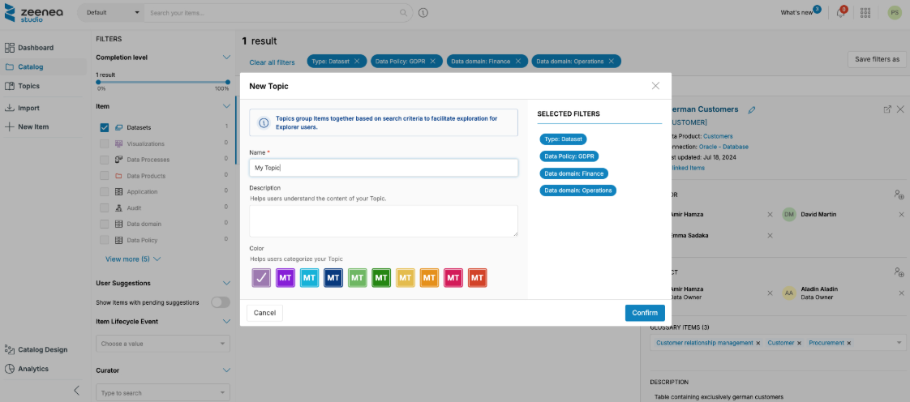
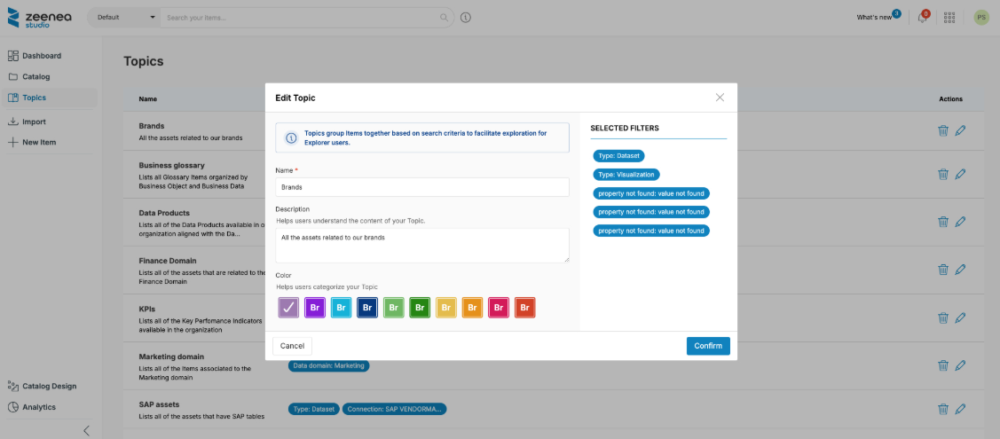
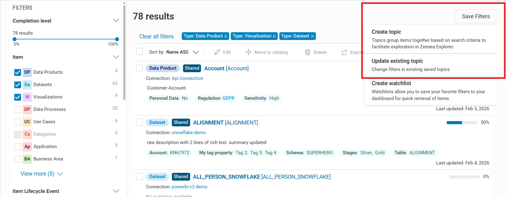
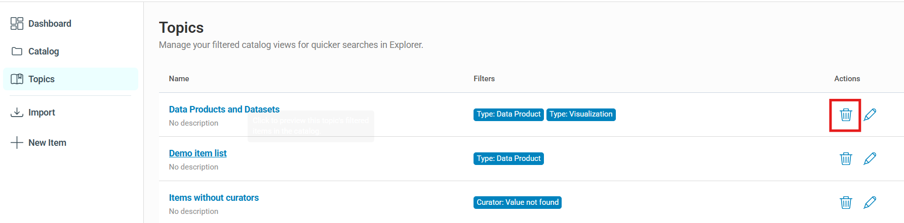

# Creating, Editing, or Deleting a Topic

Topics allow you to define collections of items to help your business users understand the concepts contained in the catalog and guide their searches.

To manage Topics, your user group must have the **Catalog Design** permission.

## Create a Topic

**To create a Topic**

1. Go to the Catalog section on the search results page.
2. Select the filters you want to include in the Topic.
3. Select **Save Filters** in the upper‑right corner, and then select **Create topic**.
4. Fill in the required information.
5. Select **Confirm**. 

    

The following information is required to create a Topic:

* **Name**: Appears on the Zeenea Explorer home page.
* **Description**: Helps Zeenea Explorer users understand the Topic.
* **Color**: Helps business users identify the Topic visually.

## Edit a Topic

You can edit a Topic's name, description, or color at any time.

**To edit a Topic**

1. Go to the **Topics** section.
2. Select the pencil icon next to the Topic name.
3. Update the information.
4. Select **Confirm**.

## Update Topic Filters

You can modify the filters associated with a Topic by using the **Save Filters** option in the Catalog section.
This allows you to modify the current filter set and apply it to an existing Topic or use it to create a new one.

### Update an Existing Topic

Use this option to apply a new filter set to an existing Topic. You can update the same Topic or apply the filters to a different one.

**To update an existing Topic filter**

1. Go to the **Topics** section in the Studio.
2. Select the Topic to open it. The Catalog opens with its filters applied.
3. Adjust the filters as needed.
4. Select **Save Filters** in the upper‑right corner, and then select **Update existing topic**.
5. Select the Topic you want to update.
   * Select the same Topic to update its filters.
   * Select a different Topic to replace its filters.
6. Select **Confirm**.

### Create a New Topic From Updated Filters

Use this option to create a new Topic from an existing filter set.

**To create a new Topic**

1. Go to the **Topics** section in the Studio.
2. Select a Topic to open it. The Catalog opens with its filters applied.
3. Adjust the filters as needed.
4. Select **Save Filters** in the upper‑right corner, and then select **Create topic**.
5. Enter the new Topic’s name, description, and color.
6. Select **Confirm**.

## Delete a Topic

You can delete a Topic at any time if it is no longer needed. 

When you delete a Topic, it no longer appears for business users in the Explorer.

**To delete a Topic**

1. Go to the **Topics** section in the Studio.
2. Select the trash icon next to the Topic name.
3. Select **Confirm**.

