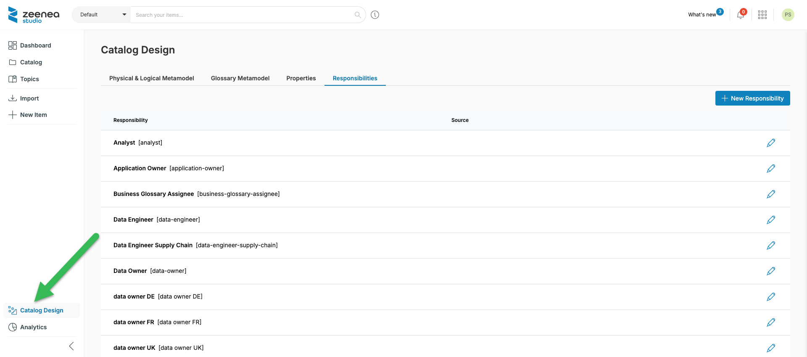
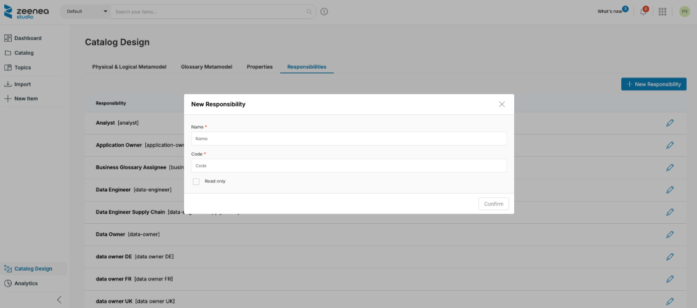
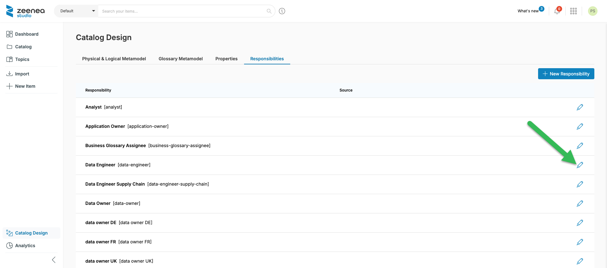

# Creating, Editing, or Deleting Responsibilities

A responsibility is the relationship between a contact (individual, team, or entity), whether internal or external to the company, and an item.

## Why define Responsibilities?

Defining responsibilities in the catalog allows you to list the different types of parties involved in the data or its documentation (for example, Data Owner, Data Steward, etc.). Assigning contacts to items will allow you to quickly and easily identify the person best suited to answer their questions.

## Accessing the Catalog Design Page

Creating, editing, and deleting responsibilities in Zeenea is done in the **Catalog Design** section of Zeenea Studio. 

To access the Catalog Design page, click **Catalog Design** in the left pane.

   

## Creating a New Responsibility

To create a new responsibility:

1. Click **Catalog design** in the left pane.
2. Click the **Create responsibility** button to access the responsibility creation screen.

   

The following information is required to create a new responsibility:

* **Name**: A unique name used to identify the responsibility in the Studio and Explorer interfaces.
* **Code**: A technical identifier used particularly in APIs to uniquely identify a responsibility.
* **Read-only**: When selected, the responsibility is not available when adding a contact to an object.

!!! note
    Responsibilities can also be imported from a connector. These are identified in the Responsibility list with the label **External source**. These responsibilities are non-editable, except for their name. Source responsibilities also have a code prefixed by `$z_`.

## Editing Responsibilities

To edit an existing responsibility, click the pencil icon next to the desired entry.

  

## Deleting a Responsibility

1. Click the name of the desired responsibility in the **Responsibilities** section to open the editing screen.
2. Click the **Delete** button.

To delete, the responsibility must meet two conditions:

* It must not be imported from a connector. 
* If necessary, remove the connector from your agent.
* It must not be implemented on an item. 

If necessary, remove all contacts assigned to this responsibility in the **Catalog** section beforehand. 