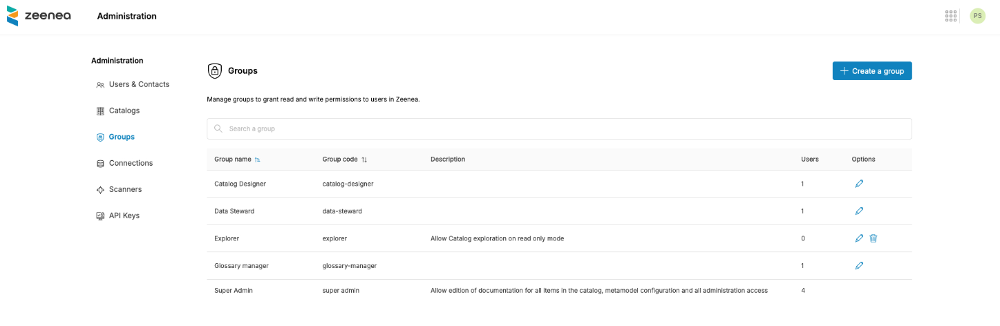
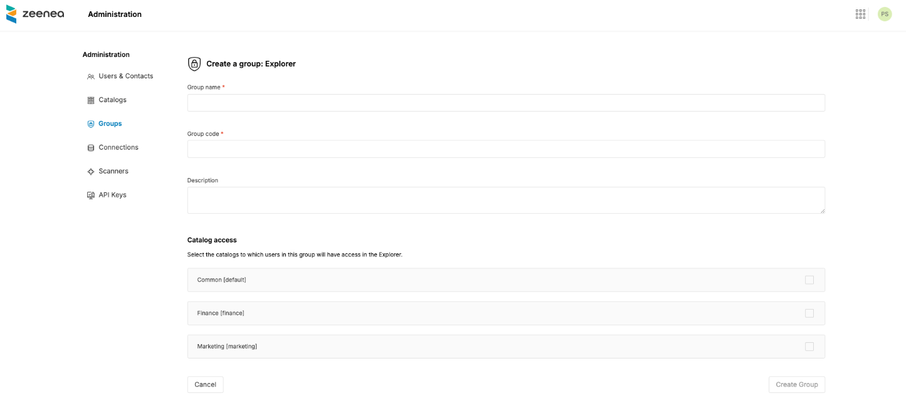
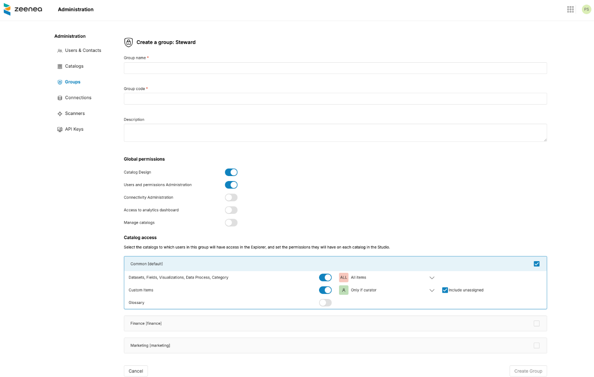

# Managing Groups

!!! note
    Groups replace Permission sets to manage user permissions in Zeenea. Existing permission sets have already been automatically migrated to Groups with the same descriptions and scopes.

Groups allow you to manage user permissions in Zeenea. You can manage groups from the Administration section.

  

## Creating a Group

To create a group, click the "Create a group" button on the top-right of the screen.

### Group Type and License

First, select a type of group: Explorer or Data Steward.

An Explorer group only grants read access to the catalog, while a Data Steward group allows granting edit permission on catalog items or administration permissions.

Note that it also corresponds to the two different license options Zeenea offers.

## Creating an Explorer-Type Group

Users without groups can access the default catalog through the Explorer application. Thus, when the Federated Catalog option is disabled, users in an Explorer group have the same access rights as users without groups.

When the Federated Catalog option is activated, you can create Explorer groups to give a user read access to one or several catalogs.

  

## Creating a Data Steward-Type Group

### Global Permissions

You can select global permissions for a Data Steward type group. Global permissions grant administration rights on the catalog. There are 6 possible global permissions:

* Catalog Design
* User and group administration
* Connectivity administration
* Access to the analytics dashboard
* Manage catalogs
* Manage agents

### Catalog Design

This permission allows users to manage all aspects of the metamodel: adding new Custom Item Types, editing templates, adding/editing/deleting properties, and adding/editing/deleting responsibilities.

### User and Group Administration

This permission allows the creation and management of users and contacts. Only users with this permission can create groups and assign them to users.

### Connectivity Administration

This permission allows users to create API Keys (for Scanner configuration for example), configure connection options (data profiling, auto import, etc.), and launch jobs on existing connections (inventory, update, etc.).

### Access to the Analytics Dashboard

This permission grants access to the analytics dashboard in the Studio with metrics regarding the completion level of the documentation and user adoption.

### Manage Catalogs

This permission allows you to create new catalogs on your tenant if the Federated Catalog option is activated for your subscription.

### Manage Agents

This permission allows users to manage agents from the **Agents** tab. Users can enable or disable agents, edit agent settings, and manage which groups can use them. For more information, see [Managing Agents](./zeenea-managing-agents.md).

### Catalog Access

In this section, you can configure the read and write permissions on catalog items for Data Stewards. Write permissions on items are divided into three categories:

* Datasets, Fields, Visualizations, Data Processes, and Categories
* Custom Items
* Glossary

For each of these permissions, you can adjust the perimeter of Data Stewards as the following:

* All Items
* Only if curator (requires to assign the user as curator on the Item to give him edit rights)
* Include unassigned (In case the "Only if curator" option is selected, you can define if Data Stewards can edit Items with no assigned curators)
* By default, you only have one catalog, so the group permissions apply to all Items (all Items belong to the default catalog).

In case the Federated Catalog option is activated, you will have the same configuration options but split by catalog.

  

### Agent Access

In this section, you can grant a Data Steward-type group permission to use the Steward agent in Studio. A group can use the agent only after it has been granted access here.

The agent must also be enabled by an administrator before any group can use it. For more information, see [Managing Agents](./zeenea-managing-agents.md).

### Adding Users to Groups

You can add users to a group from the Users & Contacts section. Note that you can assign several groups to the same user. As a result, you can define groups with complex as well as atomic permission scopes for your groups.

### Editing or Deleting a Group

You can edit a group at any time to adjust its basic information (name, description) or its associated permissions.

You can delete a group only if there are no users left in this group.

!!! note
    You can not edit or delete the Super Admin group for security reasons.
