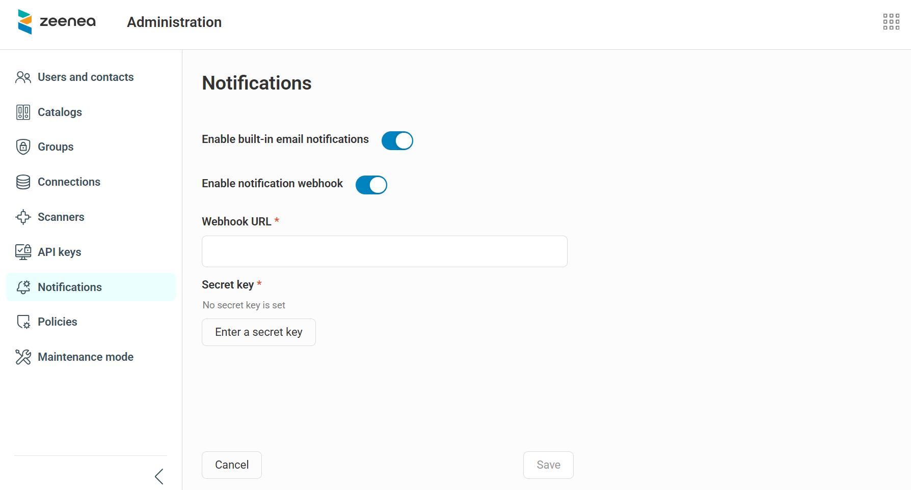

# Managing Notifications

The Actian Data Intelligence Platform provides a flexible notification system that keeps users informed about key activities. In addition to built-in email notifications, you can configure webhooks to support custom notification workflows.

If you want to customize the visual branding of notification emails, such as logos and colors, see [Platform Rebranding](../data-intelligence-platform-rebranding.md).

## Configure Notification Settings

1. Open **Administration**.
2. Go to the **Notifications** section.
3. Choose how notifications are sent by enabling one or both of the following options:
   * **Built-in email notifications**<br/> To use the default email notification system, turn on the **Enable built‑in email notifications** toggle.
   * **Webhook notifications**<br/> To send notifications through a webhook, turn on the **Enable notification webhook** toggle. The webhook uses HMAC‑based security. When you enable this option, provide the following information:
     * In the **Webhook URL** field, enter the destination URL.
     * In the **Secret key** field, enter your security key (up to 4,096 characters) to sign webhook messages.
   > **Note:** By default, built-in email notifications are enabled and webhook notifications are disabled. 
4. Click **Save**.

!!! warning "Important"
    The webhook system does not keep a history of sent notifications. You cannot resend a notification if delivery fails.



## Supported Notification Events

A single webhook handles all supported notification events. The webhook payload includes:
* Event details, such as the event type, date, and content.
* Notification details, such as the recipient user, email address, and date.

The following events trigger notifications:
* **Suggestions**: Creating a suggestion or accepting or declining a suggestion.
* **Access requests**: Creating an access request or approving or rejecting a request.

> **Note:** Auth0‑related notifications are not managed through this configuration.

## Webhook Payload Examples

### Access Request Payload Example

The following is an example of the payload sent when an access request is created, approved, or rejected.

```json
{
   "notification": {
      "recipient": {
         "name": "John Doe",
         "email": "john.doe@nobody.com"},
      "publishedAt":"2026-02-18T03:44:09Z" // UTC date
      },
   "event": {
      "type": "access request",
      "role": "approver|requester",
      "status": "Pending|Approved|Rejected",
      "callbackLink": "https://<permalink>",  // permanent URL of the item (using zeenea.app domain)
      "item":{
         "id": "7c5cacfe-2214-4857-96d5-79a79b92b7e2",
         "key": "item key",
         "name": "the requested item"
      },
      "latestComment": {
         "author": "Jane Doe",
         "content": "lorem ipsum dolor sit amet"
      }
   }
}

```

### Suggestion Payload Example

The following is an example of the payload sent when a suggestion is created or reviewed.

```json
{
   "notification": {
      "recipient": {
         "name": "John Doe",  
         "email": "john.doe@nobody.com"},
      "publishedAt": "2026-02-18T03:44:09Z" // UTC date
   },
   "event": {
      "type": "suggestion",
      "role": "creator|reviewer",
      "action": "creation|review",
      "callbackLink": "https://<permalink>",  // permanent URL of the item (using zeenea.app domain)
      "item": {
         "id": "7c5cacfe-2214-4857-96d5-79a79b92b7e2",
         "key": "item key",
         "name": "the item requested"},
      "suggestion": {
         "author": {
            "name": "Jane Doe",
            "email": "jane.doe@gmail.com"}   
         "content": "lorem ipsum dolor sit amet"},
      "review": {  // review is only filled when action is "review"
         "reviewer": "John Doe",
         "email": "john.doe@gmail.com"  
         "comment": "lorem ipsum dolor sit amet",
         "status": "accepted|rejected"}
   }
}
```