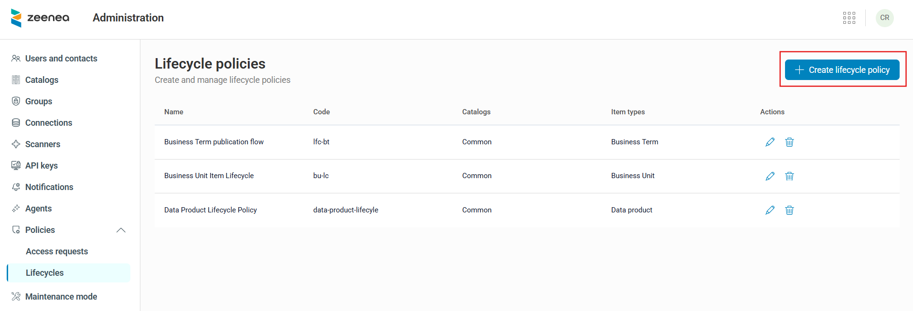
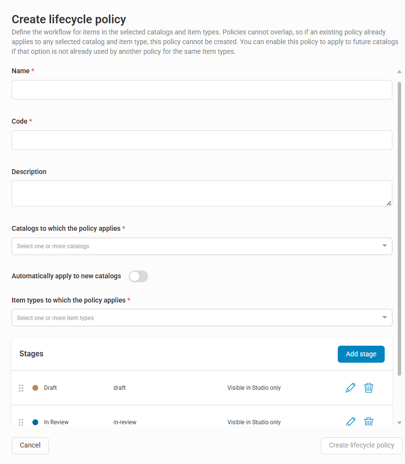
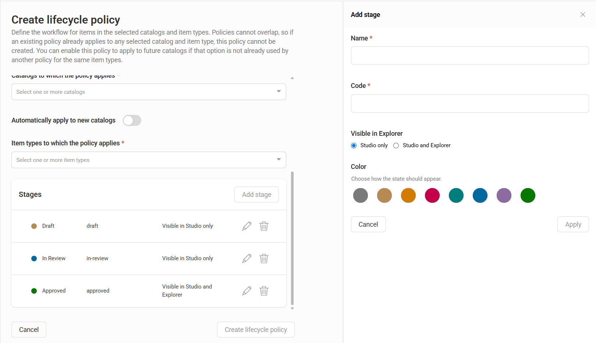
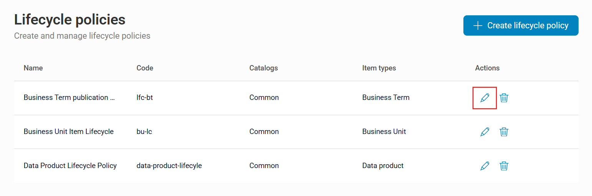
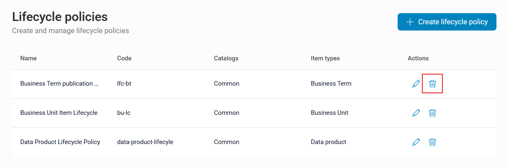

# Item Lifecycle Policies 

## Overview

Item lifecycle policies help you define structured workflows for documenting and publishing catalog items. By assigning ordered stages to items (such as **Draft**, **In Review**, **Approved**), you control when items become visible to data consumers in Explorer. This ensures that only reviewed and approved content is available to Explorer users.

Lifecycle policies also help to hide incomplete or draft content from data consumers without enforcing strict approval workflows that slow down progress. They enable governance teams to control what data consumers see while allowing curators to continue working on items in Studio without interruption.

A lifecycle policy defines a sequence of stages that items move through as their documentation is created, reviewed, and approved. 
Each stage includes:
* A name
* A code
* A color
* A visibility rule that determines whether items at that stage appear in Explorer or remain visible only in Studio

Lifecycle policies are scoped by catalog and item type. When you assign a policy to a catalog and item type combination, it applies to all matching items, both existing and new. Each catalog and item type combination can have only one lifecycle policy.

!!! warning "Important"
    Lifecycle policies support all item types except **Fields** and **Output ports**. Policies defined for datasets or data processes do not apply to their embedded items (such as fields or datasets).

## Key Concepts

The following table describes the key concepts used in lifecycle policies:

| Concept | Description |
| :---- | :---- |
| Stage | A named step in the lifecycle (such as **Draft**, **In Review**, **Approved**). Each stage has a color and a visibility rule. |
| Visibility rule | Controls whether items are visible only in Studio or also in Explorer. |
| Not staged | A system stage automatically assigned to existing items when a new policy is applied, without affecting their visibility. Only Studio users can see that an item is not staged. |
| Stage transition | The process of moving an item to the next or previous stage. |

## Typical Workflow

The following workflow illustrates how items progress through lifecycle stages from creation to publication.

1. A curator creates a new item. The platform automatically assigns the first stage defined in the policy (such as **Draft**).  
2. The curator documents the item in Studio and moves it to review stage (such as **In Review**). 
3. Reviewers identify items in review stage by using watchlists and stage filters.  
4. After review, the item is moved to the final stage (such as **Approved**).
5. The item becomes visible to data consumers in Explorer.

## Manage Lifecycle Policies

### Prerequisites

You must have a Data Steward license with **Policy management** permissions.

### Create a Lifecycle Policy

You can create new lifecycle policies in Administration.

**To create a lifecycle policy**

1. Open **Administration**.
2. Select **Policies** > **Lifecycles**. 
3. Click **Create lifecycle policy**.  
   
   The **Create lifecycle policy** window opens.
   
   
4. Complete the following fields:  
   
   * **Name** (required): Enter a descriptive name for the policy (for example, "Glossary Review Workflow").
   * **Code** (required): Enter a unique technical identifier.
   * **Description** (optional): Explain the purpose of this policy.
   * **Catalogs to which the policy applies** (required): Select one or more catalogs where the policy applies. 
   * **Automatically apply to new catalogs** (optional): Turn on this option to automatically apply the policy to newly created catalogs.
   * **Item types to which the policy applies** (required): Select one or more item types to which this policy applies (all types except Fields and Output ports).  
   * **Stages** (required): Define the ordered stages of the lifecycle. For more information about configuring lifecycle stages, see [Configure Lifecycle Stages](#configure-lifecycle-stages).  
5. Click **Create lifecycle policy**.
   
   

!!! note
    A catalog and item type combination can be associated with only one lifecycle policy. If you try to select a combination that is already used in another policy, the system rejects the selection.

#### Configure Lifecycle Stages

By default, a new lifecycle policy includes three stages: **Draft**, **In Review**, and **Approved**. 

You can customize these stages or create your own. 

!!! warning 
    A lifecycle policy must include at least two stages.

**To create a new stage**

1. Click **Add stage**.
   
   The **Add stage** window opens. 
2. Provide the following attributes: 

    * **Name**: The display name of the stage (for example, **Draft**, **In Review**, **Approved**).
    * **Code**: A unique technical identifier for the stage, used in API calls and file imports.
    * **Visible in Explorer**: Controls where items at this stage are visible. Select one of the following: 
        * **Studio only**: Items are hidden from Explorer.
        * **Studio and Explorer**: Items are visible in both Studio and Explorer.
    * **Color**: Select a color from the available palette.

3. Click **Apply** to save the stage. 
   
   The new stage appears in the list of stages for the policy.

**To edit an existing stage**

1. Click the pencil icon next to the stage. 
   
   The **Edit stage** window opens.
2. Make the required changes to the stage attributes.
3. Click **Apply** to save the changes.

**To delete an existing stage**

1. Click the trash icon next to the stage. 
   
   The **Delete lifecycle stage** dialog opens.
2. Click **Confirm** to delete the stage.
    
    !!! warning
        You cannot delete a stage if any items are currently assigned to it. In this case, the delete button is disabled, and a tooltip explains the reason.

You can reorder stages by using drag-and-drop. The order determines the allowed transitions, and items can move only to the immediately previous or next stage.

#### Apply the Policy

After you save the policy, it takes effect immediately:

* New items matching the policy’s catalog and item type criteria are automatically assigned the first stage when created (through Studio, API, or scanner import).  
* Existing items that match the criteria are assigned a **Not staged** status. The **Not staged** status is visible only in Studio and does not affect the item’s visibility in Explorer.

After applying a policy, use the stage filter in Studio to find items with the **Not staged** status. You can then update item stages individually or in bulk.

### Edit a Lifecycle Policy

You can edit lifecycle policies from Administration.

**To edit a lifecycle policy**

1. Open **Administration**.
2. Select **Policies** > **Lifecycles**. 
3. Click the pencil icon next to the policy in the **Actions** column. 
   
   The **Edit lifecycle policy** window opens.
4. Make the required changes to the policy attributes or stages.
5. Click **Save changes**.

### Delete a Lifecycle Policy

You can delete a lifecycle policy from Administration.

**To delete a lifecycle policy**:

1. Open **Administration**.
2. Select **Policies** > **Lifecycles**. 
3. Click the trash icon next to the policy in the **Actions** column. 
   
   The **Delete lifecycle policy** dialog opens.
4. Click **Confirm**. 

### Lifecycle Policy Updates

The following table describes how the platform handles changes to lifecycle policies:

| Action | Behavior |
| :---- | :---- |
| Add a catalog to a policy | You can add a catalog only if no other policy covers the same catalog and item type combination. Existing items in that catalog are updated asynchronously to **Not staged**. |
| Remove a catalog from a policy | All matching items lose their stage and return to a no-stage state. At least one catalog must remain associated with the policy. |
| Add an item type to a policy | You can add an item type only if no other policy covers the same catalog and item type combination. |
| Remove an item type from a policy | All matching items return to a no-stage state. At least one item type must remain associated with the policy. |
| Add a stage | No impact on existing items. |
| Delete a stage | You can delete a stage only if no items are currently assigned to it. |
| Delete a policy | All matching items return to a no-stage state. A confirmation dialog appears before the deletion is completed. |
| Delete a catalog from the tenant | The catalog is automatically removed from any lifecycle policies that reference it. |

## Manage Item Lifecycle Stages

### Update an Item’s Stage

Users with the **Manage documentation** permission can update the stage of an item. Stage transitions are sequential. You can move an item only to the immediately previous or next stage from the UI.

You can update an item’s stage from the Item Details Page or Item Overview Panel in Studio.

You can update the lifecycle stage of multiple items by using the **Edit lifecycle stage** option in Studio. For more information, see [Editing Items in Bulk](../studio/stewardship/zeenea-editing-items-in-bulk.md#Updating-lifecycle-stage).

!!! note
    The stage is visible in search results but cannot be updated there.

### Handle Multiple Reviews

In the current version, lifecycle policies do not support parallel reviews. If your workflow requires multiple review steps (such as technical and then business reviews), create separate stages for each step. Reviews are processed sequentially.

## Lifecycle Stages in Studio

### Search and Filter Items by Stage

A stage filter is available in Studio. You can use it to filter items by one or more lifecycle stages.

You can use the stage filter for the following purposes:

* Finding **Not staged** items after a policy is applied.
* Creating watchlists to track items at specific stages (for example, items awaiting review).

For more information about searching and filtering items in Studio, see [Searching and Filtering in Zeenea Studio](../studio/stewardship/zeenea-studio-search.md).

### View the Item Stage

The item stage is displayed as a colored label in the following locations:

* Search results (read-only)  
* Item overview panel (editable)  
* Item details page (editable)

### Stage in File Import and Export

The lifecycle stage code is included as a column in XLSX import and export files. 

During import, you can assign an item to any stage. You do not need to follow the sequential transition rule.

You can also create items at any stage, not just the first stage.

For more information about import, see [Importing a File in Zeenea](../studio/stewardship/zeenea-studio-import.md).

For more information about export, see [Exporting Search Results in Zeenea Studio](../studio/stewardship/zeenea-studio-search-export.md).

### Bulk Stage Updates

You can update the stage of multiple items by using the **Edit lifecycle stage** option in the **Edit** menu. 

For more information, see [Editing Items in Bulk](../studio/stewardship/zeenea-editing-items-in-bulk.md#update-lifecycle-stage#update-lifecycle-stage).

## Lifecycle Stages in Explorer

### Lifecycle Visibility Rules

The lifecycle policy’s visibility rules control which items appear in Explorer:

* Items at a stage with the **Studio and Explorer** visibility rule are visible in Explorer, subject to standard catalog permissions and sharing rules.
* Items at a stage with the **Studio only** visibility rule are hidden from Explorer search results, item counts, and lists. However, these items remain visible in the **lineage** and **data model** graphs. When you open the item's side panel from these graphs, a banner indicates that the item is displayed in preview mode.
* Items with the **Not staged** status remain visible in Explorer. Their visibility is unchanged from before the policy was applied.  
* Items that are not associated with a lifecycle policy are unaffected and remain visible as usual.

!!! note
    In a **Federated Catalog**, visibility is independent of the **shared** status. An item can be shared across catalogs but but remain hidden in Explorer if its stage visibility rule is set to **Studio only**.

### View the Item Stage in Explorer

The item stage is displayed as a colored label in the following locations:

- Search results  
- Item overview panel  
- Item details page

### Access Hidden Items in Explorer

You can access an item that is hidden from Explorer search results by using a direct URL or by selecting **Open in Explorer** from Studio.

In this case, a banner appears on the item details page to indicate that the item is displayed in preview mode.

## Lifecycle Stages in GraphQL API

### Read the Item Stage

The item stage is available as a built-in attribute on the Item type in the Catalog API (`lifecycleStage`). The attribute returns the stage code (for example, `draft`, `in-review`, `approved`):

* For items with no lifecycle policy, the stage attribute returns `null`.  
* For contacts, the stage attribute always returns `null`.

### Create Items With a Stage

When you create an item using the API, the platform checks whether a lifecycle policy applies. If it does:

- If you do not specify a stage, the platform assigns the first stage defined in the policy.  
- You can specify a stage code to create the item at any stage in the policy. The item does not need to start at the first stage.

### Update an Item’s Stage

You can update an item’s stage using the API and specifying the target stage code. The API allows you to set any stage defined in the policy. Sequential transition rules do not apply when you use the API.

## Lifecycle Stages in Actian Chrome Extension

The Actian Data Intelligence Chrome Extension respects lifecycle visibility rules. It displays glossary definitions only for items without a lifecycle policy or for items at stages visible in Explorer.

## Lifecycle Stages in Actian MCP Server

The Actian MCP Server returns only items that are visible in Explorer. Items at stages with the **Studio only** visibility rule are excluded from MCP queries and AI-generated responses

## Audit Trail

All lifecycle policy configuration changes are recorded in the policy audit trail:

* Policy creation and updates  
* Previous and new values for updated fields  
* User and timestamp

All stage updates on items are recorded in the item audit trail with the previous and current values.