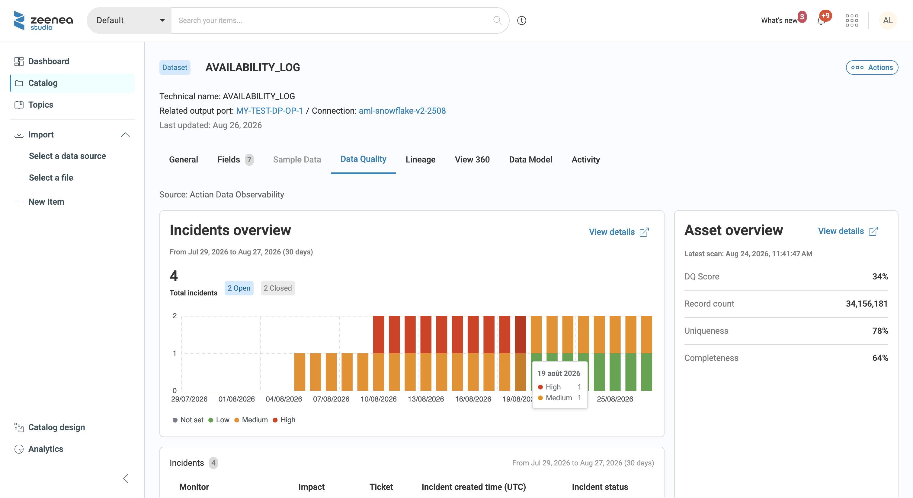
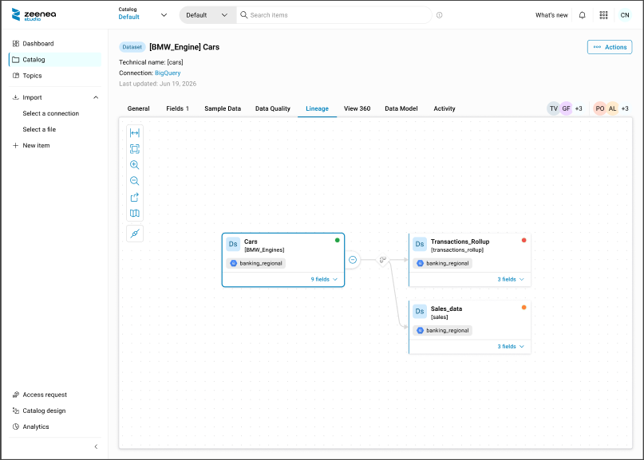
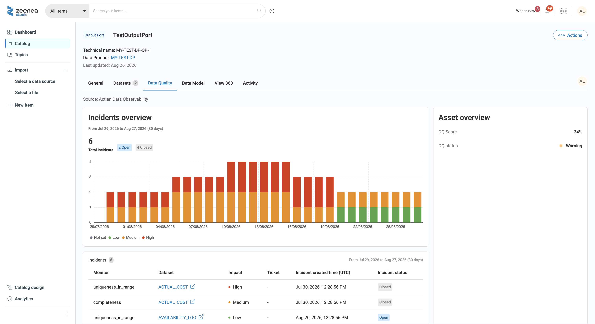

# Actian Data Observability Integration

This section applies only if your subscription includes the Actian Data Observability integration. If you want to activate this paid option, contact your Customer Success Manager (CSM).

## Overview

When a dataset is cataloged in Actian Data Intelligence Platform and monitored in Actian Data Observability, the latest data quality information is automatically synchronized from Actian Data Observability to Actian Data Intelligence Platform after each completed scan.

For a list of supported data sources, see [Supported Data Sources](link).

This information is available in both **Studio** and **Explorer** in the following locations:

* **Data Quality** tab
* **Lineage** tab

For setup and configuration instructions, see [Actian Data Intelligence Platform Integration](https://doclink).

## View Data Quality Information for Datasets 

Data quality information for datasets is available in the **Data Quality** and **Lineage** tabs.

### Data Quality Tab

The **Data Quality** tab displays incident information and data quality metrics synchronized from Data Observability.

**Incidents Overview**

The left panel displays the list of incidents detected by Data Observability with the following information:

* The total number of **Open** and **Closed** incidents.
* A histogram showing the number and severity of incidents detected during the last 30 days.
* A list of incidents that includes:
     * The monitor name in Data Observability.
     * The incident impact (**Not Set**, **Low**, **Medium**, or **High**).
     * A link to the incident in Data Observability. Select the link to open the incident in Data Observability in a new browser tab.
     * The date and time the incident was created.
     * The incident status (**Open** or **Closed**).

You can select **View Details** to open the selected dataset's Overview page in Data Observability, filtered for the selected dataset, in a new browser tab.

**Asset Overview**

The right panel displays data quality metrics synchronized from Data Observability for the selected dataset, including:

* Data quality score (for more information, see [Data Quality Score](https://docslink))
* Record count
* Uniqueness
* Completeness

### Lineage Tab

The **Lineage** tab displays a data quality health indicator for the selected dataset. The indicator color reflects the current incident status synchronized from Data Observability:

* **Green**: The dataset has no open incidents.
* **Orange**: The dataset has open incidents, but none are classified as high impact.
* **Red**: The dataset has one or more high-impact open incidents.

## View Data Quality Information for Data Products and Output Ports 

Data quality information is available at the data product and output port levels.

### Data Product

At the data product level, a data quality health indicator is displayed. The indicator uses the same color scheme as the dataset-level indicator and reflects the worst data quality status across all datasets linked to the data product through its output ports.

### Data Product Output Port

Data quality information for data product output ports is available in the **Data Quality** tab.

The following data quality information is displayed by aggregating data quality information across all linked datasets.

**Asset Overview**

The following aggregated metrics are displayed:

* **DQ score**: The lowest data quality score across all linked datasets.
* **DQ status**: The worst data quality status across all linked datasets.

**Incidents Overview**

The incidents overview displays aggregated incident information from all linked datasets.

In the incident list, you can select a dataset link to open the corresponding dataset's **Data Quality** tab in Actian Data Intelligence Platform.

## Limitations

### Integration Compatibility

The Actian Data Observability and legacy Data Quality API integrations are not supported for simultaneous use. Use only one integration at a time. 

Using both integrations can result in inconsistent data quality information. For example, information displayed in the **Lineage** tab might not match the information displayed in the dataset's **Data Quality** tab.

### Connector Matching

When using Actian Data Intelligence Platform V1 connectors, dataset matching is performed on a best-effort basis and may produce ambiguous matches.

For improved matching accuracy, use Actian Data Intelligence Platform V2 connectors, which match datasets by using data source and dataset identifiers.
