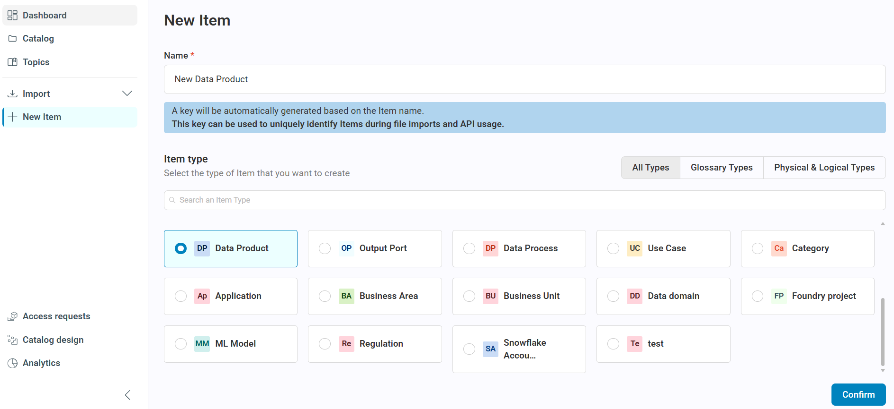
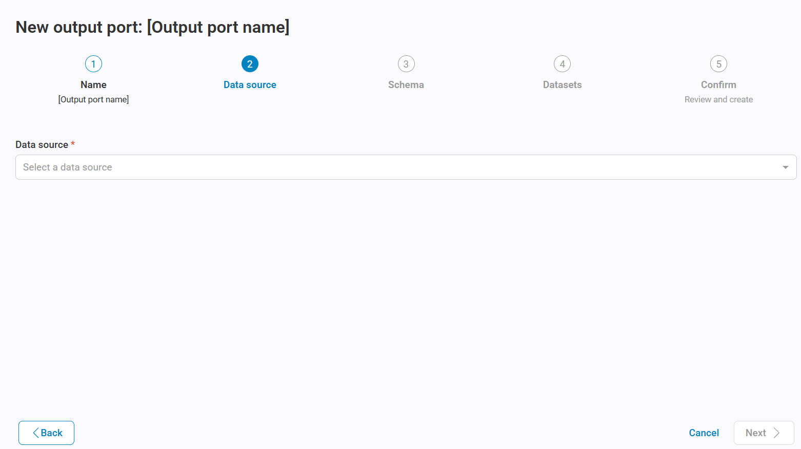
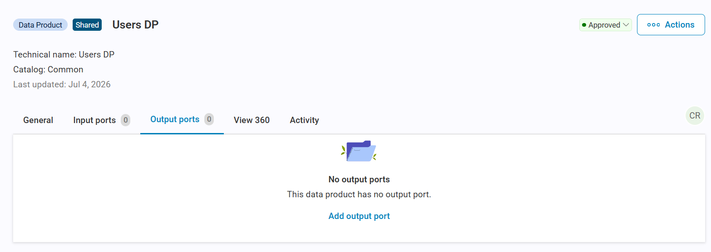
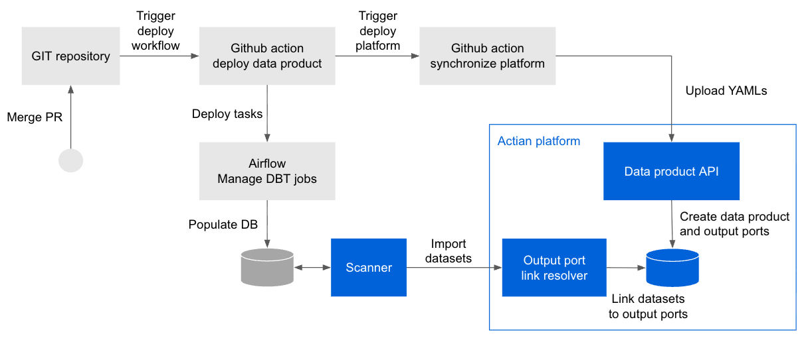
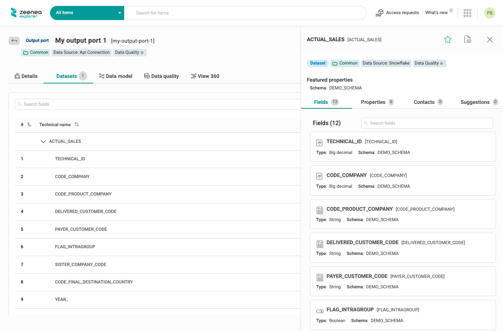
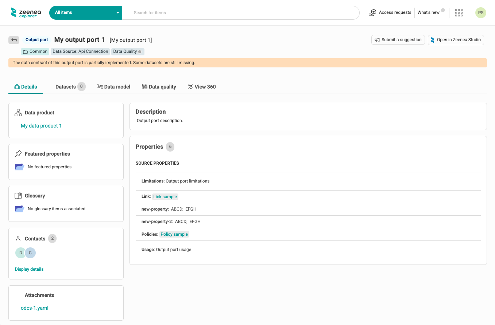
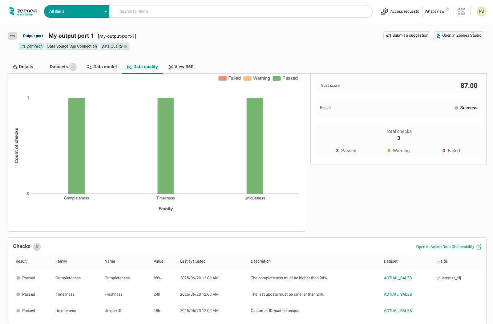
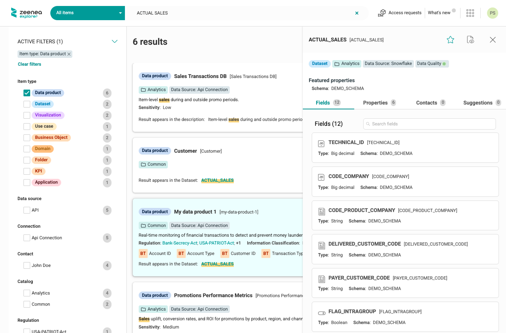

# Data Products

## Introduction to Data Products and Data Contracts

A **data product** is a reusable, active, and standardized data asset designed to deliver measurable value to its users, whether internal or external, by applying the rigorous principles of product thinking and management. It includes one or more data artifacts, such as datasets, models, and pipelines. It is enriched with metadata, including governance policies, data quality rules, data contracts, and, where applicable, a software bill of materials (SBOM) to document its dependencies and components. Ownership of a data product is aligned to a specific domain or use case, ensuring accountability, stewardship, and continuous evolution throughout its lifecycle.

Adhering to FAIR principles (findable, accessible, interoperable, and reusable), a data product is designed to be discoverable, scalable, reusable, and aligned with both business and regulatory standards, driving innovation and efficiency in modern data ecosystems.

A data product includes the following components:

* **Input ports**: An input port is a standardized interface through which a data product receives data from upstream sources. It defines how external data enters the data product. Input ports enable the controlled, traceable ingestion of data, facilitating lineage tracking and quality checks before the data is transformed and served to consumers.  

* **Output ports**: An output port is a standardized interface through which a data product exposes its data to consumers. It defines how the data can be accessed (for example, through  APIs, SQL tables, or event streams), along with its format, schema, and protocols. Output ports ensure that data products are interoperable, discoverable, and easy for other teams or systems to consume, while enforcing access controls and contracts. Each output port is associated with a data contract.  

* **Internal components**: Internal components include datasets and processes required to produce the output ports but not intended for end-users. These components are not represented in the current version of the platform.

A **data contract** is a formal agreement between a data product owner (also known as a producer) and its consumers. It defines the structure, meaning, quality expectations, and access terms of the exposed data. A data contract includes a schema definition and can also include data quality rules, Service Level Agreements (SLAs), ownership, rights, and other related information. Data contracts ensure reliable data consumption, prevent breaking changes, and promote accountability between domains.

## Data Products in the Actian Data Intelligence Platform

The Actian Data Intelligence Platform supports data products and data contracts natively. It enables organizations to manage, govern, and maximize the value of their data assets as products.

You can create and manage data products either directly in Studio or by synchronizing YAML descriptors through the Data Product API and CI/CD pipelines. 
The platform supports two types of data products:

* **User-Defined Data Product:** A data product created and managed directly in Studio. You can edit its name, description, and properties, add or remove output ports, and download its YAML descriptor at any time. For more information, see [Create Data Products in Studio](#create-data-products-in-studio).

* **Synced with Source Data Product:** A data product managed externally through the Data Product API or a CI/CD pipeline. Output ports can be managed only through the data product YAML descriptors or the API. Template properties and contacts can still be edited in Studio. For more information, see [Create Data Products with the API](#create-data-products-with-the-api).

!!! warning
    If a user-defined data product is later synchronized through the API, it automatically becomes a synced with source data product.

The platform enables you to:

* Create data products and output ports directly in Studio by using existing datasets.
* Define data products and data contracts with YAML descriptors that include all relevant information required for discovery and consumption (for example, name, description, terms and conditions, and custom properties).  
* Synchronize data products and their data contracts from your CI/CD pipelines by using the dedicated [Data Product API](../../technical-documentation/api/zeenea-data-product-api.md).
* Manage data products and their components in the Studio to enrich their documentation and publish them to the enterprise marketplace.  
* Search, find, and understand data products using the graph-powered search engine and an optimized layout dedicated to the discovery of these new item types.  
* Request access to data products directly in Zeenea Explorer and manage these requests in Zeenea Studio to allow an efficient and governed consumption of the data products.

The following are the key benefits of implementing data products in the Actian Data Intelligence Platform:

* **Enhance Data Discovery & Accessibility**

Data products are supported as native items, enabling the modeling of simple and complex data products. You can define one or more output ports for each data product to create more use-case-oriented data that meets business needs.

A dedicated and optimized search experience, powered by the knowledge graph, enables users to efficiently discover, understand, and consume data products.

* **Governance by Design**

By supporting data contracts, the platform encourages organizations in their efforts to shift left metadata management. Organizations can design data contracts early and integrate them into their CI/CD pipelines to ensure that business expectations from the data contract are met when deploying new data. Synchronizing data contracts ensures that metadata remains up to date.

User-defined data products created in Studio automatically generate ODPS and ODCS compliant YAML descriptors that can be integrated with the Data Contract Builder (coming soon) or CI/CD pipelines.

* **Scale Data Management and Governance**

Together with the federated catalog, each domain can design and manage its own data products.

The platform breaks data silos and supports a data mesh approach by allowing domains to publish their data products into the Enterprise Marketplace.

## Create Data Products in Studio

Studio enables you to create and manage data products and output ports directly from the user interface. This allows you to group existing datasets into structured data products, even before adopting full data contract governance.

Using Studio, you can define output ports, associate datasets with them, and enable access request workflows for data consumers.

Data products created in Studio automatically generate YAML descriptors that comply with the Open Data Product Standard (ODPS) and the Open Data Contract Standard (ODCS). These descriptors can later be integrated into the Data Contract Builder (coming soon) or your CI/CD pipelines.

This capability bridges the gap between initial dataset management and full data contract governance, accelerating the adoption of data products across your organization.

### Create a Data Product

You can create a user-defined data product directly from the **New Item** page in Studio.

To create a data product:

1. Open **Studio**
2. Select **New Item**.
   
     The **New Item** page opens.

3. Select **Data Product** as the item type.
4. Enter a name for the data product.
5. Click **Confirm**.
   
     The platform creates the data product and redirects you to its details page.

To add an output port to the data product, see [Add an Output Port to an Existing Data Product](#add-an-output-port-to-an-existing-data-product).



!!! note
    The data product YAML descriptor is generated only when you download it from the item details page. It reflects the current state of the data product and is not generated automatically when the data product is created.

#### Manage Output Ports

From the **Output Ports** tab of a user-defined data product, you can:

* **Add an output port**

     Select **Add output port** to add one or more output ports to the data product. This opens the output port creation wizard with the current data product preselected. For more information, see [Add an Output Port to an Existing Data Product](#add-an-output-port-to-an-existing-data-product).

* **Delete an output port**

     Delete an output port from the output port list or its details page.

### Create an Output Port

You can create an output port directly from the **New Item** page in Studio.

When you create an output port directly from the **New Item** page, the platform automatically creates a new user-defined data product and associates the output port with it.

To create an output port:

1. Open **Studio**.
2. Select **New Item**.
     
     The **New Item** page opens.

3. Select **Output Port** as the item type.
4. Enter a name for the output port.
5. Click **Confirm**.
   
     The output port creation wizard opens.

     

6. Select a data source to filter the available data sources, and then click  **Next**.
7. Select a data container, and then click **Next**.
   
     !!! warning
         In this version, only schemas are supported.

8.  Search, filter, and select one or more datasets, and then click **Next**.
   
     !!! note
         You can select all datasets at once or add them individually. Selected datasets are marked with a check mark to prevent duplicate selections. You can remove individual datasets or clear the entire selection.

9.  Review the information on the confirmation page.
10. Click **Confirm**.
    
     The platform creates the output port and redirects you to its details page.

After creation, you can edit the following attributes:

* Name
* Description
* Access request policy
* Curators

### Add an Output Port to an Existing Data Product

To add an output port to an existing user-defined data product:

1. Open the data product details page in Studio.
2. Go to the **Output Ports** tab.
3. Click **Add output port**.
   
     The output port creation wizard opens with the current data product preselected.

4. Select a data source and a data container.
5. Search, filter, and select one or more datasets.
6. Review the information on the confirmation page.
7. Click **Confirm**.
   
     The platform creates the output port and associates it with the selected data product.

!!! warning
    Only user-defined data products support adding output ports in Studio. For synced with source data products, output ports can be managed only through the data product YAML descriptor or the API.



### Manage Datasets in an Output Port

After creating an output port, you can update its associated datasets.

To manage datasets:

1. Open the output port details page.
2. Go to the **Datasets** tab.
3. Select **Manage datasets**.
   
     The dataset selection page opens, where you can add or remove datasets.

4. Add or remove datasets as needed. You can search for datasets, select all datasets, or clear the selection.
5. Review the changes on the confirmation page.
6. Click **Confirm**.
   
     The platform updates the datasets associated with the output port.

### Limitations

#### Supported Connectors

Dataset linking for Studio-created output ports is currently supported only for the following connector:

* Snowflake V2

#### Generated YAML Descriptors

In the current version, the YAML descriptors generated by the platform contain only the core structural information of data products and output ports.

Advanced attributes, such as custom properties, glossary items, and contacts, must be added after downloading the YAML files.

The generated YAML descriptors comply with the following standards:

* **Data product descriptor**: ODPS v1.0.0
* **Data contract**: ODCS v3.1.0

Other specification versions are not supported.

## Create Data Products with the API

### Define and Upload Data Products

The Actian Data Intelligence Platform leverages these standards managed by [Bitol](https://bitol.io/) (a Linux Foundation project):

* [Open Data Contract Standard (ODCS)](https://github.com/bitol-io/open-data-contract-standard)  
* [Open Data Product Standard (ODPS)](https://github.com/bitol-io/open-data-product-standard) 

These YAML files can be uploaded to the platform through a dedicated [REST API](../../technical-documentation/api/zeenea-data-product-api.md). This API can be called from external tools or the CI/CD pipelines, for example, from a GitHub Action, as illustrated in the following diagram:



The list of output ports is defined in the data product descriptor. Each output port must have a name and must be linked to a data contract ID (UUID) with its version.

```yaml
outputPorts:
- name: rawtransactions
  version: 1.0.0
  contractId: c2798941-1b7e-4b03-9e0d-955b1a872b32
```

Before calling the API, bundle the data product and all referenced data contract YAML files into a single ZIP file so that the platform can process them together.

### Manage Output Ports

#### Output Port Lifecycle

When updating a data product through the API, newly defined output port versions replace existing ones. An output port is updated only if it references the same data contract ID and version.

Output ports are read-only items in the catalog. Their documentation is fully managed through the associated data contracts, which act as the single source of truth.

Output ports that are not included in the last version of the data product descriptor are automatically deleted.

#### Link Output Ports to Imported Datasets

The data contract must define both the model of the output port (the `schema` section in ODCS) and the location of the related datasets (the `servers` section in ODCS).

```yaml
schema:
  - name: Transactions
    physicalName: transactions
    description: Real-time transaction data.
    properties:
      - name: Transaction ID
        physicalName: transaction_id
        required: true
        logicalType: string
        description: Unique transaction identifier
      - name: Account ID
        physicalName: acct_id
        required: true
        logicalType: string
        description: Account Id
```

When uploading a data product or importing a dataset from a scanner, the platform uses the `name` and `physicalName` and the `servers` section to automatically link output ports with their physical implementations. Only connectors built on the public SDK V2 are supported.

Following is an example of a `servers` section for Snowflake:

```yaml
servers:
  - id: snowflake-server-pse
    server: Snowflake server
    type: snowflake
    host: ABCDEFGH-IJ12345.snowflakecomputing.com
    port: 8080
    account: IJ12345
    database: DATABASE_1
    warehouse: SMALL_COMPUTE_WH
    schema: SCHEMA_1
```

You can link the same dataset to multiple output ports and to different data products.

!!! note
    Linked datasets do not need to belong to the same catalog.

After a link is created, the related dataset appears in the **Datasets** tab of the output port in the Studio and Explorer.



If not all datasets defined in the data contract are linked to the output port, a banner indicates that the data contract is not fully implemented.



### Manage Actian-Specific Attributes for Data Products and Output Ports

#### Manage Properties

You can use the data product and data contract YAML files to create or update properties of data products and output ports in the Data Intelligence Platform.

Properties must be defined using the `customProperties` syntax in ODPS/ODCS, with the property name `zeeneaProperties`.

The platform automatically determines the property type based on the syntax of the file:

* **Short text**: If defined as a key/value.   
* **Tag**: If defined as an array.  
* **Date**: If defined using a predefined format (ISO 8601).  
* **URL**: If defined as a valid URL.

For example:

```yaml
customProperties:
  - property: zeeneaProperties
    value:
      Sensitivity: Very High
  - property: zeeneaProperties
    value:
      Compliance: [BSA, FinCEN]
  - property: zeeneaProperties
    value:
      Documentation: https://www.acme.com
  - property: zeeneaProperties
    value:
      Approval date: 2025-10-27
```

The example above creates the following properties:

* A **Short-text** property `Sensitivity` and apply the value `Very High` to the item.  
* A **Tag** property `Compliance` and apply the values `BSA` and `FinCEN` to the item.  
* A **URL** property `Documentation` and apply the value `https://www.acme.com` to the item.  
* A **Date** property `Approval date` and apply the value `2025-10-27` to the item.

Properties are managed as source documentation, similar to source properties of a dataset. They are not mapped to the data product template.

Properties created through the data product API can be used as filters or displayed in the catalog as any other source property, depending on their type, by customizing their search and display options in the **Catalog Design** section of the Studio.

#### Manage Contacts

You can use the data product and data contract YAML files to create or update contacts on data products and output ports in the Data Intelligence Platform using the ODPS/ODCS syntax for teams.

For example:

```yaml
team:
 members:
   - username: ceastwood@acme.com
     name: Clint Eastwood
     role: data-owner
   - username: daustin@acme.com
     name: David Austin
     role: data-steward
```

The example above creates contacts with a name, email address, and source responsibilities such as `data-owner` and `data-steward`. The `role` value must be an existing source responsibility code. If the code does not exist, the platform creates it automatically using the provided value.

If the provided code corresponds to a user-defined responsibility code (created from the **Catalog Design** section), the contact is not added, and the API returns a non-blocking error.

!!! note
    The source responsibility display name can be updated in the **Catalog Design** section.

When team members are specified, the platform attempts to match an existing contact by email (using the username field).  
If the username is not a valid email address, then the platform attempts to match an existing contact by name (using the name field, and then the username field as a last fallback).

If no existing contact matches the specified contact, the platform creates a new contact.

#### Manage Links with Glossary Items

You can use the data product YAML files to create implementation links between glossary items and data products.

Links must be defined using the `customProperties` syntax in ODPS/ODCS, with the property name `zeeneaGlossaryRefs`.

```yaml
customProperties:
  - property: zeeneaGlossaryRefs
    value:
      - "business-terms/Transaction Type"
      - “business-terms/Account Type”
      - “business-terms/Account ID”
      - “business-terms/Customer ID
```

Ensure that an implementation rule is configured at the metamodel level between the Data product item type and the targeted Glossary item type in the **Catalog Design** section. Otherwise, the link will not be created.

!!! note
    Links between glossary items and output ports are not supported.

#### Manage Links with Custom Items 

You can use the data product YAML files to create links between custom items and data products.

Links must be defined using the `customProperties` syntax in ODPS/ODCS, with the property name `zeeneaCustomItemRefs`.

```yaml
customProperties:
  - property: zeeneaCustomItemRefs
    value:
      - regulation/Bank-Secrecy-Act
      - regulation/USA-PATRIOT-Act
      - regulation/FinCEN
      - "data-domain/Finance | Application"
```

!!! note
    Links between custom items and output ports are not supported in this version.

#### Manage Access Request Policies for Output Ports

You can use the data contract YAML files to apply an [access request policy](https://docs.actian.com/zeenea/#page/Features%20_%20Applications/zeenea-access-requests.html) to the output port. This allows data consumers to request access to the output port.

Access request policies must be defined using the `customProperties` syntax in ODPS/ODCS, with the property name `accessRequestPolicy`.

```yaml
customProperties:
  - property: zeeneaProperties
    value:
      accessRequestPolicy: data-product-access-request-policy
```

The specified access request policy must already exist in the platform.

#### Define the Catalog of a Data Product and its Output Ports

If multiple catalogs are defined, you can specify the targeted catalog for your data products and their output ports in the payload of the data product API request.

You can also move a data product from its original catalog to another using the Studio. All output ports are automatically moved to the same catalog. Linked datasets are not moved automatically.

## ODPS and ODCS Mapping Details in the Actian Data Intelligence Platform

The platform supports ODPS version `1.0.0` and ODCS version `3.1.0`.

Uploaded YAML files must specify the ODPS or ODCS version used and comply with the standard version syntax and contain all required attributes as defined by the standard version. Files that do not meet these requirements are not processed.

### ODPS Mapping

The following table shows how ODPS sections are mapped with the platform internal concepts and which sections are required:

| Section | Required | Mapping |
| :---- | :---- | :---- |
| Fundamentals | Yes | Partially mapped |
| Product Information | Yes | Partially mapped |
| Management Ports | No | Not mapped |
| Support and Communication Channels | No | Not mapped |
| Team | No | Partially mapped |
| Ancillary Objects: Custom Properties | No | Partially mapped |
| Ancillary Objects: Authoritative Definitions | No | Partially mapped |
| Other Properties | No | Not mapped |

* **Fully mapped**: All attributes are mapped to platform concepts.  
* **Partially mapped**: Some attributes are mapped, but not the entire list.  
* **Not mapped**: None of the attributes in this section are mapped to platform concepts.

!!! note
    Unmapped attributes or sections are ignored when the platform ingests the YAML file.

The following sections provide detailed attribute-level information for the fully and partially mapped sections.

#### Fundamentals

| Key | Required | Mapped | Description |
| :---- | :---- | :---- | :---- |
| `apiVersion` | Yes | Yes | Version of the standard used to build the data product. <br />Valid value is `1.0.0`. |
| `kind` | Yes | Yes | The kind of file this is. <br />Valid value is `DataProduct`. |
| `id` | Yes | Yes | A unique identifier used to reduce the risk of dataset name collisions. <br />This attribute must be in the format of a UUID. Otherwise, the file will not be processed. <br />This ID is used in the key of the item. |
| `name` | No | Yes | Name of the data product. |
| `version` | No | Yes | Current version of the data product. <br />Not required, but highly recommended. <br />The version is used in the key of the item. <br />The version combined with the id defines the unicity of a data product. <br />Two different data products can have the same UUID but a different version. |
| `status` | Yes | No | Current status of the data product. <br />Valid values are proposed, `draft`, `active`, `deprecated`, and `retired`. <br />Only active data products may be uploaded to the platform. |
| `domain` | No | No | Business domain |
| `tenant` | No | No | Organization identifier |
| `authoritativeDefinitions` | No | Yes | List of links to sources that provide more details on the data contract. <br />See _Ancillary Objects: Authoritative Definitions_ below. |
| `description` | No | Yes | Object containing the descriptions. |
| `description.purpose` | No | Yes | Intended purpose for the provided data. <br />Mapped to the source description of the data product. <br>Syntax example:<br><code>&nbsp;&nbsp;description:<br>&nbsp;&nbsp;&nbsp;&nbsp;purpose: Yet Another Product.</code> |
| `description.limitations` | No | No | Technical, compliance, and legal limitations for data use. <br />Can be set at the data contract level. |
| `description.usage` | No | No | Recommended usage of the data. <br />Can be set at the data contract level. |
| `description.authoritativeDefinitions` | No | No | See _Authoritative Definitions_ below. |
| `description.customProperties` | No | No | See _Custom Properties_ below. |
| `customProperties` | No | Yes | See _Custom Properties_ below. |
| `tags` | No | Yes | Tags as a list. <br>Syntax example:<br><code>&nbsp;&nbsp;tags:<br>&nbsp;&nbsp;&nbsp;&nbsp;- Managed<br>&nbsp;&nbsp;&nbsp;&nbsp;- AML<br>&nbsp;&nbsp;&nbsp;&nbsp;- Compliance</code> |

#### Product Information

| Key | Required | Mapped | Description |
| :---- | :---- | :---- | :---- |
| `inputPorts` | No | Yes | List of objects describing an input port. You need at least one, as a data product needs to get data somewhere. |
| `inputPorts.name` | Yes | Yes | When specifying an input port, it is mapped to a data process in the Intelligence platform. |
| `inputPorts.version` | No | Yes | For each version, a different instance of the output port is listed. The combination of the name and version is the key. A new (major) version would be a new output port, for simplicity. <br />This is the version of a data contract attached to the related output port for another data product. <br />The version is used with the UUID to match a specific input. |
| `inputPorts.contractId` | No | Yes | id of the data contract attached to the referred output port. |
| `inputPorts.customProperties` | No | No | Custom properties |
| `inputPorts.authoritativeDefinitions` | No | No | Authoritative definitions |
| `inputPorts.tags` | No | No | Tags |
| `outputPorts` | Yes | Yes | List of objects describing an output port. You need at least one, as a data product without output is useless. |
| `outputPorts.name` | Yes | Yes |   |
| `outputPorts.version` | No | Yes | For each version, a different instance of the output port is listed. The combination of the name, contractId, and version is the key. <br />The version is used in the item unique key. |
| `outputPorts.contractId` | No | Yes | The contract id is used in the output port unique key. |
| `outputPorts.type` | No | No | There can be different types of output ports, each automated and handled differently. Here you can indicate the type. |
| `outputPorts.description` | No | Yes | Human-readable short description of the output port. <br />The description of the data contract is used as a fallback if not defined here. |
| `outputPorts.customProperties` | No | No | Custom properties. <br />The custom properties of the output port must be defined in the data contract. |
| `outputPorts.authoritativeDefinitions` | No | No | Authoritative definitions. <br />The authoritative definitions of the output port must be defined in the data contract. |
| `outputPorts.tags` | No | No | Tags. <br />The tags of the output port must be defined in the data contract. |
| `inputContracts` | No | Yes | This attribute is used to specify the lineage of a specific output port. <br />Input contracts must be part of the input ports of the data product. |
| `inputContracts.id` | No | Yes | ID of the data contract. |
| `inputContracts.version` | No | Yes | Version of the data contract. |

#### Team

| Key | Required | Mapped | Description |
| :---- | :---- | :---- | :---- |
| `team` | No | Yes | Object representing a team. |
| `team.name` | No | No | Team name. |
| `team.description` | No | No | Team description. |
| `team.customProperties` | No | No | Custom properties block. |
| `team.authoritativeDefinitions` | No | No | Authoritative definitions block. |
| `team.tags` | No | No | Tags as a list. |
| `team.members` | No | Yes | List of members. |
| `team.members.username` | Yes | Yes | The user's username or email. <br />Using this attribute will create contacts with the `dataOwner` source responsibility in the Intelligence platform. |
| `team.members.name` | Yes | Yes | The user's name (combine first name and last name). |
| `team.members.description` | No | No | The user's description. |
| `team.members.role` | Yes | Yes | The user's job role. For example, owner, data steward. <br />This attribute is not required by the standard, but is necessary to link the contact with the right responsibility. |
| `team.members.dateIn` | No | No | The date when the user joined the team. |
| `team.members.dateOut` | No | No | The date when the user ceased to be part of the team. |
| `team.members.replacedByUsername` | No | No | The username of the user who replaced the previous user. |
| `team.members.customProperties` | No | No | Custom properties block. |
| `team.members.authoritativeDefinitions` | No | No | Authoritative definitions block. |
| `team.members.tags` | No | No | Tags as a list. |

#### Ancillary Objects

##### Custom Properties

| Key | Required | Mapped | Description |
| :---- | :---- | :---- | :---- |
| `customProperties` | No | Yes | A list of key/value pairs for custom properties. <br />The `customProperties` attribute is used to create or value source properties (Short text, Tag, Date, URL), link the data product with existing glossary items, or with existing custom items. <br />Custom properties cannot be used to value template properties created in the UI. |
| `customProperties.property` | No | Yes | The name of the key. Names should be in camel case, the same as if they were permanent properties in the contract. <br />Possible values are: <br />`zeeneaProperties`<br />`zeeneaGlossaryRefs`<br />`zeeneaCustomItemRefs` |
| `customProperties.value` | No | Yes | The value of the key. <br />Mapping in the Intelligence platform: <br />- In case of a property, the value is the name and value of the property. <br />- In case of a link, the value is the key of the targeted item. <br />The targeted item must already exist in the Intelligence platform, and the link must be allowed at the metamodel level. |
| `customProperties.description` | No | No | Optional description. |

##### Authoritative Definitions

| Key | Required | Mapped | Description |
| :---- | :---- | :---- | :---- |
| `authoritativeDefinitions` | No | Yes | A list of type/link pairs for authoritative definitions. |
| `authoritativeDefinitions.type` | Yes | Yes | Type of definition for authority. <br />Recommended values are `businessDefinition`, `transformationImplementation`, `videoTutorial`, `tutorial`, and `implementation`. At the root level, a type can also be `canonicalUrl` to indicate a reference to the product's last version. <br />Using this attribute will create a `Links` source property (URL type and multivalued). <br>Syntax example:<br><code>&nbsp;&nbsp;authoritativeDefinitions:<br>&nbsp;&nbsp;&nbsp;&nbsp;- type: privacy-policy<br>&nbsp;&nbsp;&nbsp;&nbsp;&nbsp;&nbsp;url: https://example.com</code><br>Type will be used as the label and URL as the value of the hyperlink. |
| `authoritativeDefinitions.url` | Yes | Yes | URL to the authority. |
| `authoritativeDefinitions.description` | No | No | Optional description. |

### ODCS Support

The following table shows how ODCS sections are mapped with the platform internal concepts and which sections are required:

| Section | Required | Mapping |
| :---- | :---- | :---- |
| Fundamentals | Yes | Partially mapped |
| Schema | Yes | Partially mapped |
| References | No | Not mapped |
| Data Quality | No | Not mapped |
| Support and Communication Channels | No | Not mapped |
| Pricing | No | Not mapped |
| Team | No | Partially mapped |
| Roles | No | Not mapped |
| Service-level Agreement | No | Not mapped |
| Infrastructures and Servers | No | Partially mapped |
| Custom and Other Properties | No | Partially mapped |

* **Fully mapped**: All attributes are supported and mapped to Actian concepts.  
* **Partially mapped**: Some attributes are supported, but not the entire list.  
* **Not mapped**: None of the attributes in this section are mapped to Actian concepts.

!!! note
    Unmapped attributes or sections are ignored when the platform ingests the YAML file. However, they are stored and displayed as read-only information in the user interface.

The following sections provide detailed attribute-level information for the fully and partially mapped sections.

#### Fundamentals

| Key | Required | Mapped | Description |
| :---- | :---- | :---- | :---- |
| `apiVersion` | Yes | Yes | Version of the standard used to build the data contract. <br />Valid value is `3.1.0`. |
| `kind` | Yes | Yes | The kind of file this is. <br />Valid value is `DataContract`. |
| `id` | Yes | Yes | A unique identifier used to reduce the risk of dataset name collisions. <br />This attribute must be in the format of a UUID. Otherwise, the file will not be processed. <br />This ID is used in the key of the item. |
| `name` | No | No | Name of the data contract. |
| `version` | Yes | Yes | Current version of the data contract. |
| `status` | Yes | No | Current status of the data contract. <br />Valid values are `proposed`, `draft`, `active`, `deprecated`, and `retired`. |
| `tenant` | No | No | Indicates the property the data is primarily associated with. <br />Value is case-insensitive. |
| `tags` | No | Yes | A list of tags that may be assigned to the elements (object or property); the tags keyword may appear at any level. Tags may be used to better categorize an element. For example, `finance`, `sensitive`, `employee_record`. <br>Syntax example:<br><code>&nbsp;&nbsp;tags:<br>&nbsp;&nbsp;&nbsp;&nbsp;- Managed<br>&nbsp;&nbsp;&nbsp;&nbsp;- AML<br>&nbsp;&nbsp;&nbsp;&nbsp;- Compliance</code> |
| `domain` | No | No | Name of the logical data domain. |
| `dataProduct` | No | No | Name of the data product. |
| `authoritativeDefinitions` | No | Yes | List of links to sources that provide more details on the data contract. <br />Using this attribute will create a `Links` source property (URL type and multivalued). <br>Syntax example:<br><code>&nbsp;&nbsp;authoritativeDefinitions:<br>&nbsp;&nbsp;&nbsp;&nbsp;- type: privacy-policy<br>&nbsp;&nbsp;&nbsp;&nbsp;&nbsp;&nbsp;url: https://example.com</code><br> Type will be used as the label and URL as the value of the hyperlink. |
| `description` | No | Yes | Object containing the description. |
| `description.purpose` | No | Yes | Intended purpose for the provided data. <br />Mapped to the source description of the output port as a fallback to the description provided in the ODPS file. <br>Syntax example:<br><code>&nbsp;&nbsp;description:<br>&nbsp;&nbsp;&nbsp;&nbsp;purpose: Yet Another Product.</code> |
| `description.limitations` | No | Yes | Technical, compliance, and legal limitations for data use. <br />Using this attribute will create a `limitations` source property (Rich text). |
| `description.usage` | No | Yes | Recommended usage of the data. <br />Using this attribute will create a `usage` source property (Rich text). |
| `description.authoritativeDefinitions` | No | No | List of links to sources that provide more details on the dataset. Examples would be a link to a privacy statement, terms and conditions, license agreements, data catalog, or another tool. <br />Using this attribute will create a `Policies` source property (URL-type). The type will be used as the label and the value as the URL. |
| `description.customProperties` | No | No | Custom properties that are not part of the standard. |

#### Schema

##### Schema (Top-level)

| Key | Required | Mapped | Description |
| :---- | :---- | :---- | :---- |
| `schema` | Yes | Yes | Array. A list of elements within the schema to be cataloged. <br />Objects are mapped to the dataset concept and are used to link the output port to imported datasets in the platform. |

##### Applicable to Elements (either Objects or Properties)

| Key | Required | Mapped | Description |
| :---- | :---- | :---- | :---- |
| `name` | Yes | Yes | Name of the element. <br />Mapped for Objects only and used to link the output port to an imported dataset. |
| `physicalName` | No | Yes | Physical name. <br />Mapped for Objects only and used to link the output port to an imported dataset. |
| `physicalType` | No | No | The physical element data type in the data source. <br />For objects: `table`, `view`, `topic`, `file`.  <br />For properties: `VARCHAR(2)`, `DOUBLE`, `INT`, etc. |
| `description` | No | No | Description of the element. |
| `businessName` | No | No | The business name of the element. |
| `authoritativeDefinitions` | No | No | List of links to sources that provide more details on the element. Examples would be a link to a privacy statement, terms and conditions, license agreements, data catalog, or another tool. |
| `quality` | No | No | List of data quality attributes. |
| `tags` | No | No | A list of tags that may be assigned to the elements (object or property); the tags keyword may appear at any level. Tags may be used to better categorize an element. <br />For example, `finance`, `sensitive`, `employee_record`. |
| `customProperties` | No | No | Custom properties that are not part of the standard. |

##### Applicable to Objects

This section is not required and is not mapped.

##### Applicable to Properties

Some keys are more applicable when the described property is a column.  
This section is not required and is not mapped.

##### Logical Type Options

Additional metadata options to more accurately define the data type.  
This section is not required and is not mapped.

#### Team

| Key | Required | Mapped | Description |
| :---- | :---- | :---- | :---- |
| `team` | No | Yes | Object representing a team. |
| `team.name` | No | No | Team name. |
| `team.description` | No | No | Team description. |
| `team.customProperties` | No | No | Custom properties block. |
| `team.authoritativeDefinitions` | No | No | Authoritative definitions block. |
| `team.tags` | No | No | Tags as a list. |
| `team.members` | No | Yes | List of members. |
| `team.members.username` | Yes | Yes | The user's username or email. <br />Using this attribute will create contacts with the `dataOwner` source responsibility in the Intelligence platform. |
| `team.members.name` | No | Yes | The user's name (combine first name and last name). |
| `team.members.description` | No | No | The user's description. |
| `team.members.role` | Yes | Yes | The user's job role. <br />For example, owner, data steward. <br />This attribute is not required by the standard, but is necessary to link the contact with the right responsibility. |
| `team.members.dateIn` | No | No | The date when the user joined the team. |
| `team.members.dateOut` | No | No | The date when the user ceased to be part of the team. |
| `team.members.replacedByUsername` | No | No | The username of the user who replaced the previous user. |
| `team.members.customProperties` | No | No | Custom properties block. |
| `team.members.authoritativeDefinitions` | No | No | Authoritative definitions block. |
| `team.members.tags` | No | No | Tags as a list. |

#### Infrastructure & Servers

| Key | Required | Mapped | Description |
| :---- | :---- | :---- | :---- |
| `server` | Yes | Yes | Identifier of the server. |
| `id` | No | Yes | A unique identifier used to reduce the risk of collisions, such as a UUID. |
| `type` | Yes | Yes | Type of the server. Can be one of: api, athena, azure, bigquery, clickhouse, cloudsql, custom, databricks, db2, denodo, dremio, duckdb, glue, hive, impala, informix, kafka, kinesis, local, mysql, oracle, postgres, postgresql, presto, pubsub, redshift, s3, sftp, snowflake, sqlserver, synapse, trino, vertica, zen. |
| `description` | No | No | Description of the server. |
| `environment` | No | No | Environment of the server. <br />Examples includes: prod, preprod, dev, uat. |
| `roles` | No | No | List of roles that have access to the server. For more information, see [Roles](https://bitol-io.github.io/open-data-contract-standard/latest/roles/). |
| `customProperties` | No | No | Custom properties that are not part of the standard. |

Each server type can be customized with different properties such as host, port, database, and schema, depending on the server technology in use. Refer to the specific documentation for each server type for additional configurations.  
If your server is not in the list, use the type [Custom Server](https://bitol-io.github.io/open-data-contract-standard/latest/infrastructure-servers/#custom-server).

#### Custom and Other Properties

##### Custom Properties

| Key | Required | Mapped | Description |
| :---- | :---- | :---- | :---- |
| `customProperties` | No | Yes | A list of key/value pairs for custom properties. <br />The `customProperties` attribute is used to create or value source properties (Short text, Tag, Date, URL), link the output port with existing glossary items, or assign an access request policy. <br />Custom properties cannot be used to value template properties created in the UI. |
| `customProperties.property` | No | Yes | The name of the key. Names should be in camel case, the same as if they were permanent properties in the contract. <br />Possible values are: <br />`zeeneaProperties` <br />`zeeneaGlossaryRefs` |
| `customProperties.value` | No | Yes | The value of the key. <br />Mapping in the Intelligence platform: <br />- In case of a property, the value is the name and value of the property. <br />- In case of a glossary link, the value is the key of the targeted item. The targeted item must already exist in the Intelligence platform and the link must be allowed at the metamodel level. <br />- In case of an access request policy, the value is `accessRequestPolicy: [the code of the policy]`. |
| `contractCreatedTs` | No | No | Timestamp in UTC of when the data contract was created, using ISO 8601. |

##### Authoritative Definitions

| Key | Required | Mapped | Description |
| :---- | :---- | :---- | :---- |
| `authoritativeDefinitions` | No | Yes | A list of type/link pairs for authoritative definitions. |
| `authoritativeDefinitions.id` | No | No | A unique identifier for the element used to create stable, refactor-safe references. <br />Recommended for elements that will be referenced. For more information, see [References](https://bitol-io.github.io/open-data-contract-standard/latest/references/). |
| `authoritativeDefinitions.type` | Yes | Yes | Type of definition for authority. <br />Recommended values are `businessDefinition`, `transformationImplementation`, `videoTutorial`, `tutorial`, and `implementation`. At the root level, a type can also be `canonicalUrl` to indicate a reference to the data contract's latest version. <br />Using this attribute will create a `Links` source property (URL type and multivalued). <br>Syntax example:<br><code>&nbsp;&nbsp;authoritativeDefinitions:<br>&nbsp;&nbsp;&nbsp;&nbsp;- type: privacy-policy<br>&nbsp;&nbsp;&nbsp;&nbsp;&nbsp;&nbsp;url: https://example.com</code><br> The type will be used as the label, and the URL as the value of the hyperlink. |
| `authoritativeDefinitions.url` | Yes | Yes | URL to the authority. |
| `authoritativeDefinitions.description` | No | No | Optional description. |

## Manage Data Product Documentation in Studio

### Data Product Template

You can manage the data product template and responsibilities as any other item type in the **Catalog Design** section. It allows curators to provide metadata in addition to that harvested from the source with the API.

You can also configure data products to implement glossary items in the Glossary metamodel section.

!!! note
    Output ports do not have a template and cannot implement glossary items.

!!! warning "Important"
    During the Beta phase, pre-existing template properties remain on output ports. Actian will implement an automatic migration, coinciding with the feature's general availability, which will result in the deletion of all current template property values from existing items.

### Data Product and Output Port Attributes

#### Data Product Attributes

##### General Information

Data products have the following common attributes:

* Name / Source name  
* Description / Source description  
* Properties / Source properties  
* Contacts / Source contacts  
* Glossary items  
* Links with custom items  
* Catalog

In Studio, curators can manage data product properties defined in the template from their side panel and details page. They can also manage these properties using bulk actions and file import.

##### Input Ports Tab

In the **Input ports** tab of a data product, all the sources consumed by the data product's input ports are listed. The input ports themselves are displayed only in the lineage.

##### Output Ports Tab

In the **Output ports** tab of a data product, all the output ports to be consumed by the end-users are listed.

##### Data Quality Status

The data quality status of a data product is calculated from the data quality status of its output ports.

##### Attachments

In Explorer, you can download the YAML descriptor of the data product.

#### Output Port Attributes

##### General Information

Output ports have the following common attributes:

* Source name  
* Source description  
* Source properties  
* Source contacts  
* Catalog (inherited from the parent data product)

##### Datasets Tab

The **Datasets** tab lists all the datasets and their fields that compose the output port.

##### Data Model Tab

The **Data model** tab shows the relationships between the datasets of the output ports.

##### Data Quality Tab and Status

The **Data quality** tab lists all checks performed for all the datasets that compose the output port. For each check, a link allows the user to open the side panel of the corresponding dataset.

The data quality status of the output port is calculated from the quality status of its datasets.



##### Attachments

In Explorer, you can download the YAML descriptor of the data contract attached to the output port.

### Delete a Data Product

You can delete a data product from the Studio. When you delete a data product, its output ports are also automatically deleted. The dataset linked to the output ports is not deleted.

### Share a Data Product in Marketplace

Data products can be shared in the marketplace when the federated catalog option is activated. When you share a data product, its output ports and the datasets that compose them are shared automatically.

### Move a Data Product to Another Catalog

In Studio, you can move a data product to another catalog when the federated catalog option is activated. When you move a data product, its output ports and the datasets that compose them are moved automatically.

You cannot move a data product to another catalog using the data product API. Attempting to do so generates a non-blocking error.

### Search for Data Products

In Explorer and Studio, you can search data products using their own attributes or the attributes of their output ports. Output ports are not displayed in search results. Datasets linked to output ports are displayed in search results.



### Request Access to a Data Product

In Explorer, users can request access to data products at the output port level.

To enable access requests for data product output ports, create an [access request policy](../cross-application-features/zeenea-access-requests.md) in Administration. Then the access request policy must be provided in the data contract.