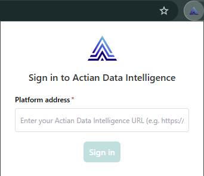
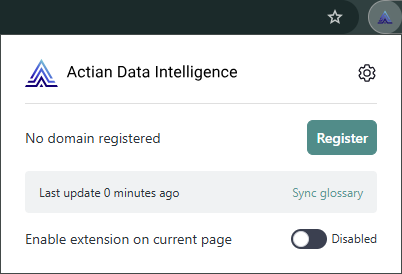

# Actian Data Intelligence Chrome Extension

## Overview

Actian provides a Google Chrome extension that enables dashboard and BI report users to quickly access standardized KPI, business term definitions and report documentation directly within their BI tools (for example, Power BI and Tableau), without leaving the report.

This extension automatically loads and highlights your glossary terms on any webpage. It also retrieves report documentation from the Data Intelligence Platform and displays it in a side panel.

### Key Benefits

* **Faster Insights**: Access definitions and report documentation without leaving the report.
* **Improved Data Literacy**: Ensure consistent understanding of KPIs across teams.  
* **Governance and Compliance**: Maintain consistent business definitions.
* **Increased Productivity**: Reduce interruptions and confusion when analyzing reports.
  
### Core Capabilities

* Automatically search and retrieve report and dashboard documentation from the Data Intelligence Platform.
* Highlight KPI terms in BI dashboards and reports.
* Instantly display definitions on hover using the business glossary.
* Works across major BI platforms.
* Integrate with the business glossary.

## Getting Started

### Installation and Permissions

Install the extension from the Chrome Web Store: [Actian Data Intelligence Chrome Extension](https://chromewebstore.google.com/detail/actian-data-intelligence/jjcocddhenjhpfaoipmngjoceainmdie)

The extension declares the following permissions in its manifest:

```json
   "permissions": [
     "scripting",
     "storage",
     "identity",
     "activeTab"
   ]
```
The following list provides more details about these permissions:

* `scripting`: Injects scripts and CSS to search for glossary terms and manage tooltip and side panel content.
* `storage`: Stores the glossary cache and user preferences.
* `identity`: Stores the authentication token.
* `activeTab`: Allows the extension to access the active browser tab.

You can pin the extension to the browser toolbar for quick access.

### User Authentication

After installation, enter the Data Intelligence Platform URL and sign in using your credentials (same as for the Studio or Explorer).



The platform uses Auth0 with PKCE for user authentication. The access token is stored locally in `chrome.storage.local`.

If your account is removed from the platform, the extension attempts to refresh the token. If the refresh fails, all locally stored data is cleared, and the user is signed out.

### Glossary Synchronization

After signing in, synchronize the extension to load glossary definitions from your organization’s catalog in the Data Intelligence Platform. The extension stores this data locally.

* Synchronization runs automatically once per day.
* To trigger synchronization manually, select **Sync glossary**.

## Use the Extension

### Activate the Extension

The extension is disabled by default.

To activate it, select the extension icon in the browser toolbar:

* For one-time use on a specific page, turn on **Enable extension on current page**.
* For recurring use on a subdomain, select **Register**.

To disable the extension, turn off **Enable extension on current page**, or select **Registered** to unregister the domain.



### View Glossary Definitions

When the extension is activated on a specific page or subdomain, it reads the page content and highlights the terms that match business terms or KPIs in the local glossary.

When you hover over a highlighted term, a tooltip displays its definition. Select **View more** to see additional details.

### Access Report Documentation

When the extension is activated on a specific page or subdomain, it reads the page URL and queries the Data Intelligence Platform to find a matching documented report or dashboard (Visualization item type). 

If a match is found, an **About this report** button appears as an overlay on the page. Select this button to open a side panel that displays the report documentation from the Data Intelligence Platform.

### Data Handling and Privacy

The extension reads the page content only when it is activated for the current page or subdomain. It does not access other browser tabs.

Only the URL of the active tab is sent to the Data Intelligence Platform. Page content is not sent to the platform. Glossary matching is performed locally in the browser.

Tooltip and side panel content are rendered using innerHTML and Shadow DOM to prevent style conflicts with the host page.

!!! note
    The extension does not sanitize data. It uses data from the Data Intelligence Platform, which is sanitized during ingestion.

## Manage the Extension

### Manage Registered Domains

Registered domains are stored locally and listed on the extension options page.

You can delete a registered domain from the options page or by selecting the **Registered** button in the extension menu while browsing a page within that domain.

### Update Extension

Google Chrome automatically checks for updates and installs new versions when the browser restarts.

### Delete Stored Data

From the extension **Options** page, you can delete all stored data (credentials, glossary, and registered domains) without uninstalling the extension. 

You must sign in again to use the extension.

### Uninstall Extension

From the Chrome **Manage extensions** page, you can uninstall the extension. 

All stored data is deleted automatically.

## Data Storage and Tracking

The extension stores the following data locally:

* Authentication token
* Registered domains
* Glossary cache

It does not store or send any other user activity data to the Data Intelligence Platform.