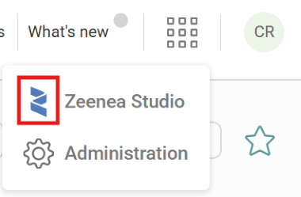
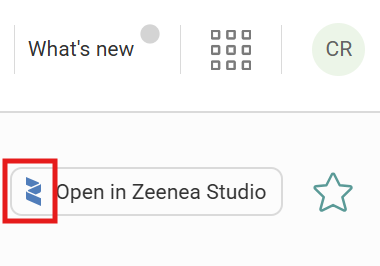
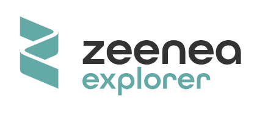
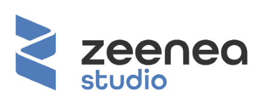
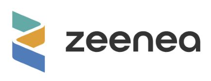
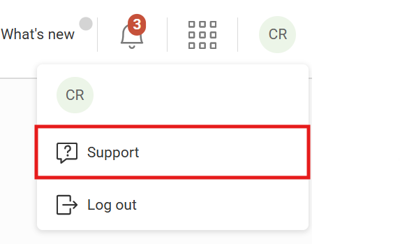
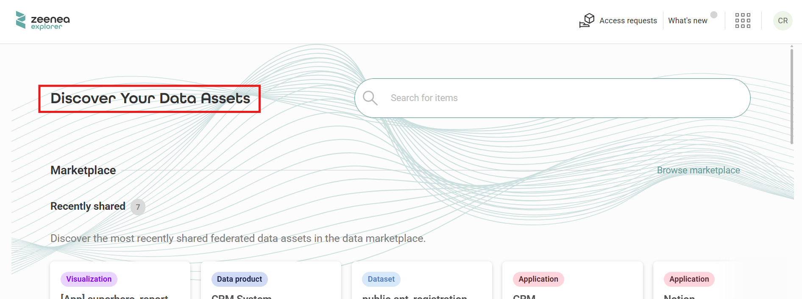
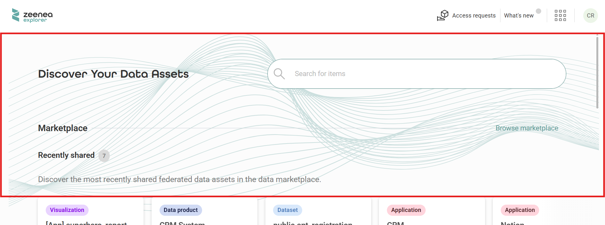

Platform Rebranding
===================

The Actian Data Intelligence Platform supports platform rebranding, which allows your organization to  customize the visual identity of the platform to match your corporate brand.

Platform rebranding is available as a service offering. To activate it, contact your Actian Customer Success Manager (CSM).

Organizations can provide their rebranding assets, which are validated and deployed as part of the platform configuration to ensure consistency, stability, and accessibility.

Platform rebranding applies to the following applications:
* **Studio**
* **Explorer**
* **Administration**

Each application supports application‑specific rebranding assets.

## What You Can Customize

Platform rebranding allows you to customize selected visual and textual elements across the platform.

### Application Names

You can customize application names that appear throughout the platform, including:

* Application names displayed in page headers.
* Application names in the application switcher.
* Action labels, such as **Open in Studio** or **Open in Explorer**.
  
  For example:
  * **Open in Studio** can be changed to **Open in _<custom Studio name>_**.
  * **Open in Explorer** can be changed to **Open in _<custom Explorer name>_**.

Browser window and tab titles automatically reflect the customized application names.

### Logos

Platform rebranding supports simple logos and compound logos, depending on where the logo is displayed.

**Simple Logos**

Simple logos consist of the logo symbol only, without accompanying text. These logos are used in lightweight UI contexts, including:

* The application switcher.
  
  

* **Open in app** actions (for example, **Open in Studio** or **Open in Explorer**).
  
  

You can provide one simple logo per application.

**Compound Logos**

Compound logos combine the logo symbol with text, such as the platform name or the platform name together with the application name. These logos are used in page headers and on loading screens.

You can provide three compound logo assets, one for each context:
* **Explorer compound logo**: Used in the **Explorer** application. Displays the Explorer logo with the application name.
  
  

* **Studio compound logo**: Used in the **Studio** application. Displays the Studio logo with the application name.
  
  

* **Global compound logo**: Used in the **Administration** application header and on all application loading pages. Displays the global logo with the platform name.
  
  

### Favicons

You can configure custom favicons for each application:

* **Explorer**
* **Studio**
* **Administration**

A default favicon is used for shared surfaces (such as error pages) or as a fallback when an application‑specific favicon is not provided.

### Primary Brand Color

You can replace the platform’s default primary color with a custom brand color. The color applies consistently across the user interface. You can use any valid CSS color format, for example, hexadecimal, RGB, HSL, or OKLCH.

### Export File Names

When platform rebranding is enabled, the platform removes the platform name from exported file names.

### Notifications

You can apply platform rebranding to notification emails.
The following email elements can be customized:
* Logo
* Primary brand color

The structure, layout, and wording of notification emails remain unchanged.

To fully control notification rebranding, use notification webhooks. For more information about webhook configuration, see [Managing Notifications](./administration/zeenea-managing-notifications.md).

### Support Link

You can configure a custom support URL that appears in the **Studio** and **Administration** applications. This allows users to access your organization’s support portal directly from the platform.

### Explorer‑Specific Customization

The following customization options apply only to the **Explorer** application.

#### Homepage Title Font

You can customize the **Explorer** homepage title font to match your brand guidelines.

> **Note:** Only the **Explorer** homepage title font is customizable. System fonts remain unchanged to ensure platform layout stability.

#### Homepage Background Graphic

You can apply a custom background graphic to the **Explorer** homepage.

## Rebranding Asset Input Format

All platform rebranding assets are provided as a single archive. All assets are optional.

| Asset	| Input	| Notes |
|-------|-------|-------|
| Favicons	| `favicon-explorer.svg` `favicon-studio.svg` `favicon-admin.svg` `favicon.svg`	| `favicon.svg` is the default favicon for gateway error pages and the GraphQL playground. It also serves as a fallback when no application-specific favicon is provided. |
| Brand color	| A new entry to the `.yml` file: `brand-color`	| Any valid CSS color format is supported (for example, hexadecimal, RGB, HSL, or OKLCH (recommended)). |
| Simple logos	| `logo-simple-explorer.svg` `logo-simple-studio.svg` `logo-simple-admin.svg`	| Used in the application switcher and Open in app actions.  |
| Compound logos	| `logo-explorer.svg` `logo-studio.svg` `logo-default.svg`	| Used in headers and loading pages. |
| Explorer home title font	| `explorer-home-title-font.ttf`	| `.ttf` format is required. |
| Explorer home background	| `explorer-home-background.svg`	| `.svg` format is required. |
| Support link	| A new entry to the `.yml` file: `support-url`	| A valid URL is required. |

