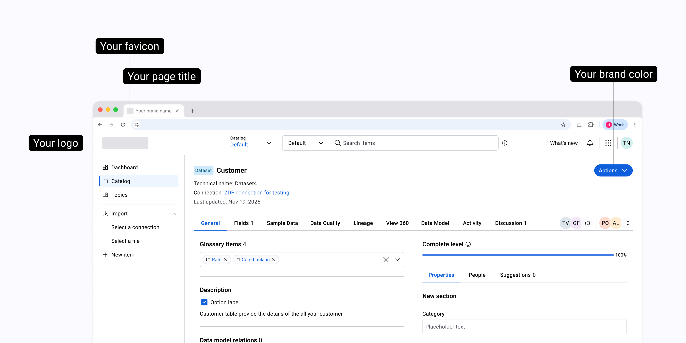
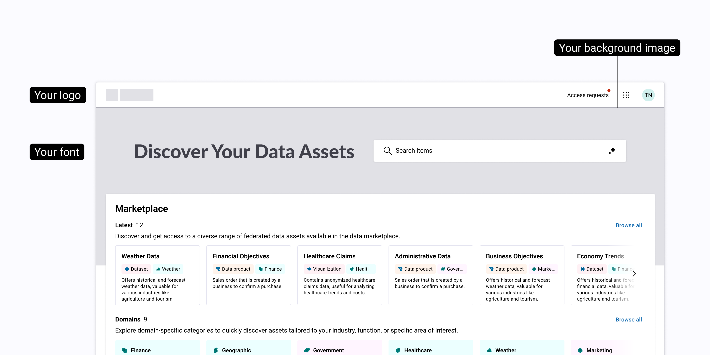

# White-Labeling

## Overview

White-labeling allows you to customize the appearance of Actian Data Intelligence Platform applications with your organization's branding. By replacing selected branding elements, you can create a consistent experience for your users while preserving the standard platform functionality.

White-labeling is supported for the following applications:

* Studio
* Explorer
* Administration

Depending on your requirements, you can apply your branding across all supported applications or to individual applications.

This document defines the branding inputs required to deliver a high-quality branded experience. 

## Supported Customizations

The following branding elements can be customized across supported applications:

| Customization | Support Level | Details |
| :---- | :---- | :---- |
| Application Logo | Supported | Single logo for all applications or application-specific logos |
| Favicon | Supported | Single favicon or application-specific favicons |
| Primary Brand Color | Supported | Replaces Actian primary color |
| Fonts | Limited | Explorer homepage heading (H1) only |
| Email Branding | Supported through webhook integration | Logo and primary color only |
| Homepage Background | Supported | Explorer application only (managed by the Actian Design team) |

The following illustration shows branding elements that can be customized across supported applications, including the application logo, favicon, browser page title, and primary brand color.



The following illustration shows branding elements that can be customized on the Explorer homepage, including the application logo, homepage heading font, and background image.



## Required Branding Inputs

Depending on your requirements, you must provide the following branding assets:

**Required Assets**

* Application logo
* Favicon
* Primary brand color

**Optional Asset**

* Explorer homepage heading (H1) font

!!! note
    Our Design team will customize the background image on the Explorer homepage based on the colors you have provided.

**Required Text Inputs**

In addition to branding assets, you must provide the following text inputs where applicable:

* **Browser page title text**: Text displayed in the browser tab and window title.

* **Application names**: Text used in application navigation and actions, for example, **Open in _<custom Studio name>_**.

!!! note
    These text inputs are required to complete white-labeling for supported areas and must be finalized before implementation.

## Asset Specifications

All assets must meet the specifications outlined below to be approved.

### Application Logo

You can use a single logo across all applications or provide application-specific logo variants. Application-specific logos should maintain a consistent visual identity while adapting colors or backgrounds when necessary.

#### Logo Specifications

| Requirement | Specification |
| :---- | :---- |
| File format | SVG  |
| Background | Transparent |
| Aspect ratio | 1:1 (Square) |
| Minimum size | 256 × 256 px |
| Maximum file size | 1 MB |
| Color mode | RGB |

#### Quality Requirements

* Logos must remain legible at small sizes, such as in headers and loading screens.
* If a logo cannot maintain sufficient clarity at small sizes, provide a simplified variant.

!!! note
    Logo design and branding strategy are the responsibility of your organization.

### Favicon

Favicons are displayed in browser tabs and bookmarks.

Depending on your requirements, you can provide either a single favicon for all applications or application-specific favicons.

#### Favicon Specifications

| Requirement | Specification |
| :---- | :---- |
| File format | SVG |
| Aspect ratio | Square (1:1) |
| Scope | Single favicon or application-specific favicon |

### Primary Brand Color 

You can provide one primary brand color for your organization. The platform derives the required color shades from the primary color to support UI states (hover, active, and disabled) and maintain consistent theming across the platform.

#### Color Specifications

| Supported | Specification |
| :---- | :---- |
| Format | HEX value |
| Usage | Replaces the default primary color |
| Accessibility | Must meet WCAG AA contrast requirements |

#### Color Limitations

* Gradients and secondary color palettes are not supported.
* Color adjustments might be recommended if the selected color affects accessibility or usability.

### Font

You can customize the font used for the Explorer homepage heading (H1) only. All other platform text uses the default system-defined font (Roboto).

#### Font Specifications

| Requirement | Specification |
| :---- | :---- |
| Scope | Explorer H1 messaging only |
| File format | TTF |
| Licensing | Proof of web embedding or distribution rights required |

!!! warning "Important"
    Fonts may be rejected if they negatively affect layout or readability.

### Email Branding

Email branding supports limited customization.

For more information, contact your Customer Success Manager (CSM).

## Package and Submit Branding Assets

Provide all branding assets as a single ZIP archive using the following folder structure.

!!! warning "Important"
    File names must clearly indicate their intended usage.

#### Folder structure

```text
white-labeling-assets/
│
├── logos/
│   ├── studio-logo.svg
│   ├── explorer-logo.svg
│   └── admin-logo.svg
│
├── favicons/
│   └── favicon.svg
│
├── fonts/
│   └── explorer-h1.ttf
│
└── brand-colors.txt
```

!!! note
    Incomplete or incorrectly packaged submissions may delay review and approval.

## Asset Validation and Review

Submitted assets are reviewed to ensure they meet the requirements described in this document, including:

* Completeness against the specified requirements
* Visual clarity at the required formats and sizes
* Accessibility and contrast compliance
* Consistency across applications

After the assets are implemented, a branded version of the platform may be shared with you for review and approval.

!!! note
    If revisions are required, feedback will be provided before final approval.

    Implementation begins once all required assets have been received and approved.

## Unsupported Customizations

The following customizations are outside the scope of white-labeling:

* Custom user interface layouts or structural changes
* Multiple themes within the same tenant
* Custom icons other than logos and favicons
* Email template redesign or copy customization
* Application functionality changes or feature changes

Requests outside this scope require separate review and agreement.


