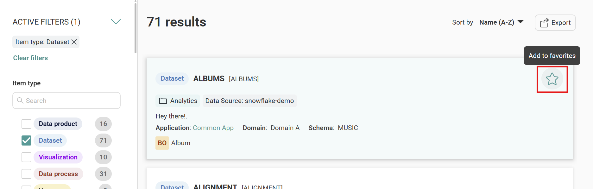
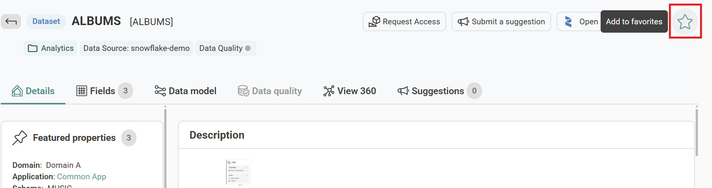
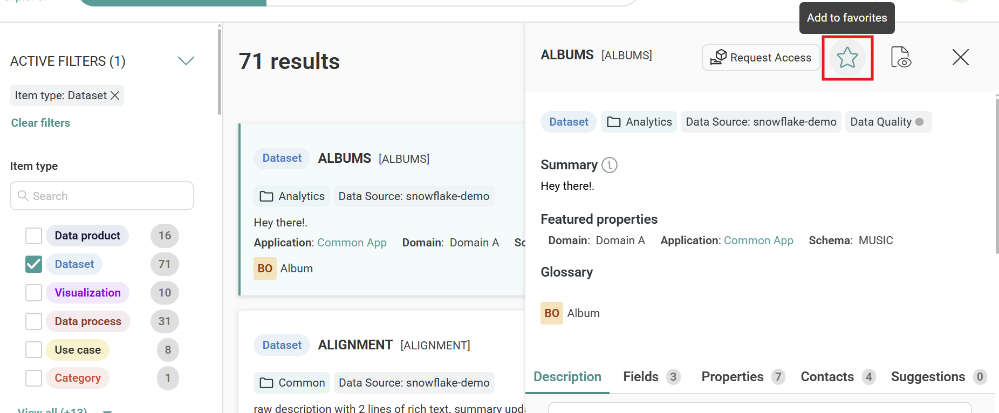
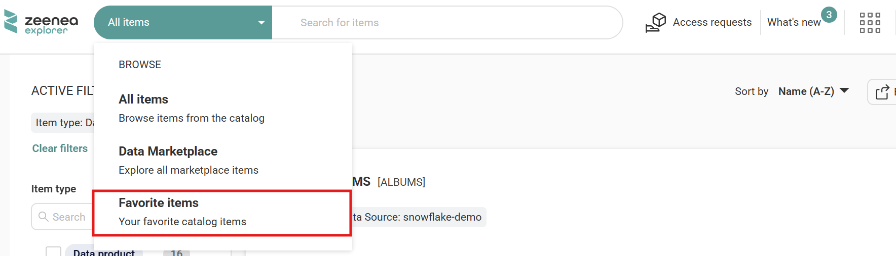
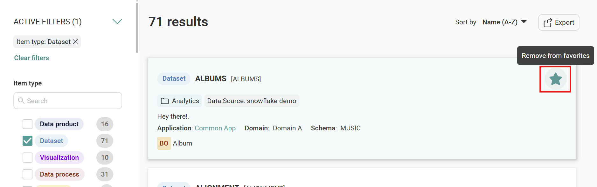

# Favorite Items

This feature enables you to mark catalog items as **Favorite Items** and access them from a dedicated list. This single-click approach saves time and effort from searching repeatedly for the same catalog item or relying on browser bookmarks.

Whether you're revisiting key datasets, monitoring critical documentation, or keeping tabs on frequently referenced assets, **Favorite Items** help you work faster and stay organized.

## Mark an Item as a Favorite

You can mark an item as a favorite from multiple locations in Zeenea Explorer:

* **From the Search Results Page**
  1. Go to your search results.
  2. Hover over an item row. An empty star icon appears on the right side.
  3. Click the empty star icon to mark it as a favorite. The star changes to filled, indicating the item is marked as a favorite.
     
* **From the Item Details Page**
  1. Open the item details page.
  2. Click the empty star icon at the top of the page. The star changes to filled, indicating the item is marked as a favorite.
     
* **From the Side Overview Panel**
  1. Select an item to open the side overview panel.
  2. Click the empty star icon at the top of the panel. The star changes to filled, indicating the item is marked as a favorite.
     

> **Note:** Only searchable items can be marked as favorites.

## View Your Favorite Items

You can access your favorite items from the main navigation.

1. Click the search bar dropdown in Zeenea Explorer.
2. Select **Favorite Items** from the dropdown list. Your list of favorite items appears.

## Remove an Item from Favorite

To remove an item from your favorites, click the filled star icon from any of the following locations:

* Search Results Page
* Item Details Page
* Side Overview Panel

The star icon changes to empty, indicating the item is no longer a favorite.

