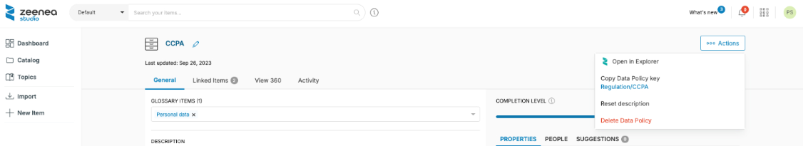

# Identification Keys

## Uses
In order to facilitate imports and exports of all objects in the Catalog, being able to uniquely identify them is necessary. Identification Keys are also useful when synchronizing the Catalog with an External System using the APIs. 

Each item in the Catalog has its own key. Keys are generated automatically as follows:

* When an item is imported using a scanner, its key is generated based on data source information. A data source is automatically associated with each imported item. For more information about data sources, see [Definitions](../../../getting-started/zeenea-definitions.md#data-source).
  The key format depends on the connector type.
     * For V1 connectors, the key is generated using the connection code. 
     * For V2 Connectors, the key is generated using the data source information. It does not refer to the connection code. 
  
  The key generation also depends on the item type. Key generation for synchronized items is provided in the documentation for each connector. Keys generated in this way are always unique and cannot be modified.

* Keys are automatically generated for Custom Items, Glossary Items and Data Processes. 

For Glossary Items, the key is created by combining the object type code (defined in the Catalog Design) with its name, e.g., the key for a Glossary item type "KPI", name "Revenue per customer", then the key will be "KPI/Revenue per customer". 
For manually created Data Processes, the key will always be a combination of "data-process" and the name of the object : a Data Process named "Quality Check" will have the following key "data-process/Quality Check".

* In case multiple items of the same type share the same name, their keys will be incremented.

!!! note
    Keys are case sensitive.

## Managing Keys using the Interface
For each object, the Key can be retrieved directly from the **Actions** button in their detailed view in the Studio. 

  

## Unique Keys and Import Files
Keys are used to uniquely identify each object of the catalog when [importing](./zeenea-studio-import.md)/[exporting](./zeenea-studio-search-export.md) an Excel File. 

When importing data via an Excel file, if there is a value in the column "key", then: 

* If that key is assigned to an existing item in the catalog, then that item is updated with the information contained in the file. 
* If the key does not exist, then the item will be created with the key defined in Excel.

If the "key" column is empty, then an item is created and its key automatically generated, based on the rules defined above. 

!!! note
    Importing the same file multiple times can generate duplicates.

## Unique Keys and API
Keys are used to uniquely identify items using the API. 

You may edit existing keys, or choose a key upon an item's creation, by using the item mutation API service.