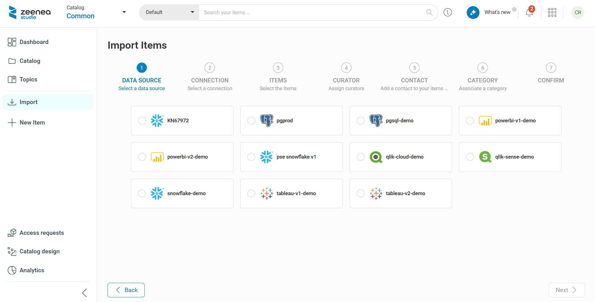

# Importing Datasets or Visualizations

## Requirements 
To import Datasets or Visualizations  into Zeenea, you must first: 

1. Install a scanner.
2. Install the plugin of the connector that is appropriate to your storage system.
3. Configure a connection to your storage system.
4. Launch an inventory of this connection to allow the connector to automatically discover the Items available for import.

These steps are described in the sections: [Zeenea Scanner Setup](../../../technical-documentation/scanners/zeenea-scanner-setup.md) & [Managing Connections](../../administration/zeenea-managing-connections.md).

## Import Datasets or Visualizations

If all requirements are met, you can access the import wizard by clicking **Import** button from Studio, and then selecting **Select a data source**". Only specific profiles are allowed to import items.

  

### Step 1: Data Source

Select the data source corresponding to the items to import. Data sources are identified in the wizard by their technical name.

### Step 2: Connection

Select the connection from the list of connections associated with the selected data source. The list is filtered based on the data source selected in the previous step.

Some specifics about this step:

* If only one connection is available for the selected data source, it is selected automatically.
* Only connections that support an inventory are available, specifically those of type **dataset** or **visualization**. The other "synchronized" connections are imported automatically in an all-or-nothing mode. 
* Connections with automatic import enabled are not displayed. If all connections for a data source have automatic import enabled, no connections are displayed for that data source in this step. If needed, you can force an automatic import from the administration interface.

### Step 3: Items

Search for items using one of the following methods:

* Browse folders by clicking their names
* Use the search bar

Select the items to import:

* Individually: Click **Select this item** next to an item.
* In bulk: Click **Select all** to add all items in a folder to your import

Select the **Show previously imported items** checkbox to display items that have already been imported into the catalog.

### Step 4: Curators (Optional)

You can assign one or more **Curators** to datasets during import. Curators act as Stewards responsible for documenting the imported datasets.

!!! note
    If a user performing the import does not have permission to edit unassigned items, that user is automatically assigned as a curator for the newly imported items.

### Step 5: Contact (Optional)

You can assign a contact and a responsibility to the datasets selected for import. 

### Step 6: Category (Optional)

For datasets only, you can assign a category from the list of existing categories.

### Step 7: Confirm

Before confirming the import, a summary of the operations to be performed is displayed.

!!! warning "Important"
    After confirmation, the window closes and the import is performed asynchronously. The operation may take several minutes, depending on the number of items selected.

## Specificities of Certain Imports

For datasets:

* For these imports, the fields are also imported automatically. Once associated with the source dataset, the fields also become searchable items in Zeenea.
* For some connections, the automatic import of the Data processes associated with this dataset is possible (for example, Atlas)

For visualizations: 

* The import of visualizations, if the connection allows it, can also include the associated datasets and their fields.

The imported items appear progressively in the Catalog section. Once the import is completed, a notification is sent with the number of imported items and the number of failures, if any. This notification makes it easy to find the list of imported items.