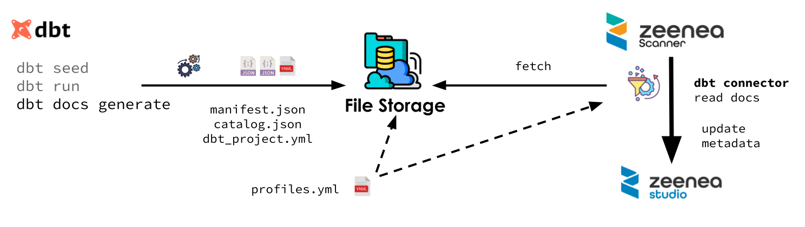

# Adding a DBT Connection

## Prerequisites

* A user with sufficient permissions is required to establish a connection with DBT.
* Zeenea traffic flows towards DBT must be open.

!!! note
    You can find a link to the configuration template in [Zeenea Connector Downloads](zeenea-connectors-list.md).

## Supported Versions

The DBT connector was tested with version 1.3. It is compatible with version 1.3 and earlier.

!!! note
    The DBT connector is currently **NOT** compatible with DBT Cloud. DBT Cloud is handled by a separate dedicated connector.

## Installing the Plugin

The DBT plugin can be downloaded here: [Zeenea Connector Downloads](./zeenea-connectors-list.md).

For more information on how to install a plugin, please refer to the following article: [Installing and Configuring Connectors as a Plugin](./zeenea-connectors-install-as-plugin.md).

## Declaring the Connection

Creating and configuring connectors is done through a dedicated configuration file located in the `/connections` folder of the relevant scanner.

Read more: [Managing Connections](../../features-applications/administration/zeenea-managing-connections.md)

In order to establish a connection with a DBT instance, specifying the following parameters in the dedicated file is required:

| Parameter | Expected value |
| --- | --- |
| `name` | The name that will be displayed to catalog users for this connection. |
| `code` | The unique identifier of the connection on the Zeenea platform. Once registered on the platform, this code must not be modified or the connection will be considered as new and the old one removed from the scanner. |
| `connector_id` | The type of connector to be used for the connection. Here, the value must be `dbt-v2` and this value must not be modified. |
| `connection.path` | Path to the DBT projects. Must be formatted like: - AWS S3: `s3://[bucket_name]/[optional_prefix]` - Google Storage: `gs://[bucket_name]/[optional_prefix]` - Local File System: `file:///path/to/project/folder/root` or `/path/to/project/folder/root` - (**≥2.8.0**) Azure ADLS Gen 2: `http://[account_name].dfs.core.windows.net/[container_name]/[optional_prefix]` - (**< 2.7.0**) Azure Storage: `az://[bucket_name]/[optional_prefix]` Examples:  `connection.path = "s3://dbt-bucket/projects"` or `connection.path = "/var/dbt/projects"` |
| **Google Cloud Storage** | |
| `connection.google_cloud.json_key` | JSON key either as: - an embedded raw value (use triple quotes `"""{ "json: "here" }"""`) - or as a file by setting an absolute file URL  (e.g., `file:///etc/bigquery/zeenea-key.json`)  Using the file URL to an external JSON key file is recommended. |
| `connection.google_cloud.project_id` | Project Id used at connection. Invoices will be sent to this project. |
| **AWS - S3**   In **version 2.7.0 and later**, the connector uses the official Amazon SDK. So the following parameters can be set to specify a region and an access key. If not set, information will be taken from: 1. environment variables 2. shared credential and config files 3. ECS container or EC2 instance role See [Amazon documentation](https://docs.aws.amazon.com/sdk-for-java/latest/developer-guide/credentials.html). |
| `connection.aws.region` | **Added in 2.7.0**  Amazon S3 region |
| `connection.aws.access_key_id` | Amazon S3 Access Key Identifier.  *Prefer to use container or instance role for versions 2.7.0 and later*. |
| `connection.aws.secret_access_key` | Amazon S3 Secret Access Key.  *Prefer to use container or instance role for versions 2.7.0 and later*. |
| **Azure ADLS Gen 2**    In **version 2.8.0 and later**, the connector can fetch the files from ADLS Gen 2. Two authentication methods are available: 1. Service Account OAuth2 credentials (`client_id`, `client_secret`, `tenant_id`) 2. Account Key (`account_name`, `account_key`) |
| `connection.azure.tenant_id` | Tenant Identifier |
| `connection.azure.client_id` | Client Application Identifier |
| `connection.azure.client_secret` | Client Application Secret |
| `connection.azure.account_name` | Storage Account Name |
| `connection.azure.account_key` | Storage Account Secret Key |
| **Azure Storage**    *Azure Storage support is discontinued in version 2.7.0 of the connector. If you need it, please contact support for it to be added again.* |
| `connection.azure.account_name` | **Before 2.7.0**  The Storage Account Name |
| `connection.azure.account_key` | **Before 2.7.0**  Account Key; can be retrieved in the Access Key section of the Azure menu. |
| `multi_catalog.enabled` | Set to `true` if the dataset source system is also configured as `multi catalog`. Default value `false`. |
| `dbt.profiles_yml` | (Optional) Path to the profiles file. Must be formatted like: - Amazon S3: `s3://bucket_name/path/to/profiles.yml` - Google Storage: `gs://bucket_name/path/to/profiles.yml` - (≥2.8.0) Azure ADLS Gen 2: `http://[account_name].dfs.core.windows.net/[container_name]/[optional_prefix]` - File System: `file:///path/to/profiles.yml` or `/path/to/profiles.yml` If not set, the first found file will be used: - `$DBT_PROFILES_DIR/profiles.yml` - `$HOME/.dbt/profiles.yml` - `/profiles.yml` **Note**: The YAML should not contain anchors or references. |
| `dbt.target` | (Optional) Target environment name. If not set the default target of the profile is used. |

## Data Extraction

In order to collect metadata, the user must provide the DBT files to the connector.

These files can be in the file system of the computer where the scanner is installed. The file system can be local or a mounted network file system (an NFS mount, for instance). It can also be an Amazon S3 or a Google Cloud Storage bucket.

### Finding Projects

First, the connector walks through the file storage from the root given in the parameter `connection.path` and searches for files with the name `dbt_project.yml`.

For each `dbt_project.yml` file found, it will consider the folder to be a DBT project. The identifier of items from a project is prefixed by the path of the project folder relative to the `connection.path` in order to ensure identifier uniqueness.

!!! note
    When nested `dbt_project.yml` files are found, only the outermost (first-level) project is retained. Sub-projects inside a project folder are ignored.

### Extracting Metadata

Metadata is extracted from `manifest.json` and `catalog.json`. These two files are produced when running the DBT process. Their location is given by the optional `target-path` entry in `dbt_project.yml`. If not set, they will be found in the `target` subfolder of the project.

`catalog.json` is optional. When present, it provides additional metadata such as the owner of each table. When absent, the connector will continue extracting metadata from `manifest.json` alone.

The connector needs some extra information about the data source from the `profiles.yml` file. This file can be shared by all projects. It can be the same file used in production or a similar one with all connection information except the credentials. The connector also looks for a `profiles.yml` file placed directly in each project folder.

For a given project, the connector uses the profile defined by the `profile` entry in `dbt_project.yml`. The target used is either the target defined by `dbt.target` in the connector configuration or the default one defined in the profile.

### Pre-required DBT commands

`manifest.json` and `catalog.json` are produced when running DBT. To ensure they are complete, the following commands should be executed.

* **dbt seed**: https://docs.getdbt.com/reference/commands/seed
* **dbt run**: https://docs.getdbt.com/reference/commands/run
* **dbt docs generate**: https://docs.getdbt.com/reference/commands/cmd-docs

## Collected Metadata

### Synchronization

The connector will synchronize all DBT project's jobs and automatically represent them in the catalog.

### Lineage

The DBT connector is able to retrieve the lineage between datasets that have been imported to the catalog. Datasets from other connections must have been previously imported to the catalog to be linked to the DBT process. This feature is available for the following systems and, for it to work, an additional parameter is needed in **the configuration file of the source system connection** as configured in the DBT connection configuration panel. For example, if the DBT process uses a table coming from a SQL Server table, then a new alias parameter must be added in the SQL Server connection configuration file.

Table summarizing the possible values of the `alias` parameter to be completed in the data source configuration file:

| Source System| Model | Example |
| :--- | :--- | :--- |
| [SQL Server](./zeenea-connector-sqlserver.md) | Server name:port/Database name | `alias = ["zeenea.database.windows.net:1433/db"]` * |
| [Snowflake](./zeenea-connector-snowflake.md) | Server name/Database name | `alias = ["kn999999.eu-west-1.snowflakecomputing.com/ZEENEA"]` * |
| [BigQuery](./zeenea-connector-google-bigquery.md) | `bigquery.googleapis.com/` + BigQuery project identifier | `alias = ["bigquery.googleapis.com/zeenea-project"]` |
| [AWS Redshift](./zeenea-connector-aws-redshift.md) | Server name:port/Database name | `alias = ["zeenea.cthwlv3ueke2.eu-west-3.redshift.amazonaws.com:5439/database"]` * |
| [PostgreSQL](./zeenea-connector-postgresql.md) | Server name:port/Database name | `alias = ["my-postgres-host:5432/mydb"]` * |
| [Oracle](./zeenea-connector-oracle.md) | Server name:port/Database name | `alias = ["my-oracle-host:1521/mydb"]` * |

### Data Process

* **Name**
* **Source Description**
* **Technical Data**:
  * Project
  * Doc Generation Time
  * Last Modified
  * Owner
  * Database
  * Schema
  * Package
  * Type

## Unique Identification Keys

A key is associated with each item of the catalog. When the object comes from an external system, the key is built and provided by the connector.

Read more: [Identification Keys](../../features-applications/studio/stewardship/zeenea-identification-keys.md)

| Object | Identifier Key | Description |
| --- | --- | --- |
| Dataset | code/path/type.package_name.resource_name | - **code**: Unique identifier of the connection noted in the configuration file - **path**: (Optional) Path to the project folder - **type**: Kind of materialization - **package_name**: Package name - **resource_name**: Resource name |