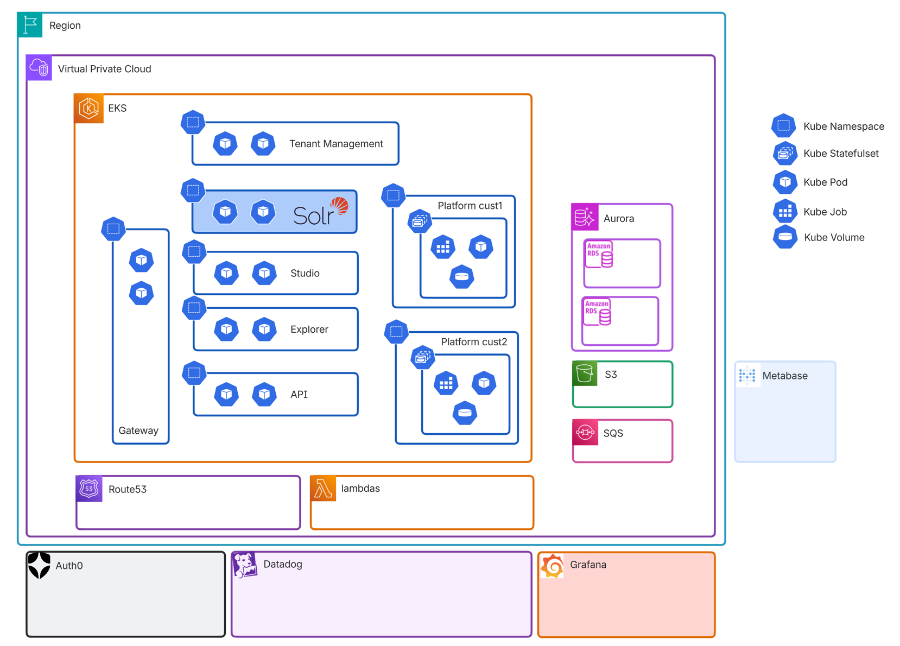

Actian Data Intelligence Reference Architecture
================================================

This section provides a high-level overview of the Actian Data Intelligence Platform architecture.
 

## Platform Components

* **Auth0** is an authentication service provider that allows customers to configure Single Sign-On (SSO) for the platform.
* **Datadog** is a monitoring platform used to observe and monitor the entire infrastructure.
* **Grafana** is another monitoring platform deployed in a customized setup that allows detailed monitoring of the infrastructure.
* **Metabase** is the data source for consolidated business metrics. It provides deeper insight into how customers use the platform.
* **Solr** is the search engine implementation currently used by the platform. It is deployed on Amazon EKS.
* **AWS (Amazon Web Services)** is the core cloud platform that hosts the Actian Data Intelligence Platform.
     * **Amazon EKS (Elastic Kubernetes Service)** is the Kubernetes implementation used by the platform. All custom platform components are deployed on Amazon EKS. The platform includes:
         * Multi-tenant stateless components
         * Mono-tenant stateful components
     * **AWS Lambda** hosts stateless microservices that can scale automatically based on demand.
     * **Amazon Route 53** is used to declare and manage customer domain names.
     * **Amazon Aurora** is used as the relational database service.
     * **Amazon S3** is used to store short-term files.
     * **Amazon SQS (Simple Queue Service)** is the queue service used to handle data transfers between the run zone and the analytics zone.