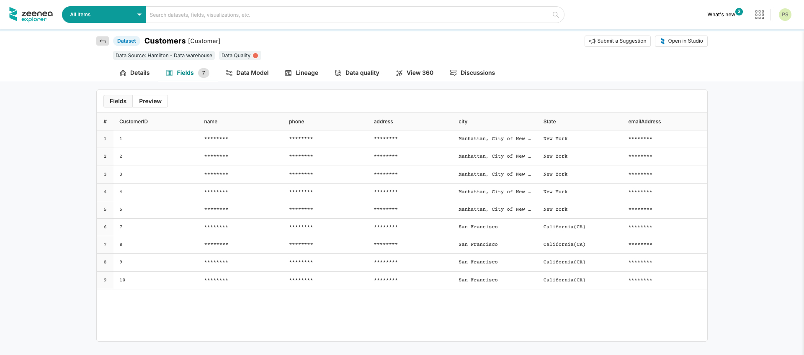

# Data Sampling

## What is Data Sampling?

Data sampling is a statistical analysis technique used to select, manipulate and analyze a representative subset of the inputs to a Dataset to identify patterns and trends in the data set under examination.

In the data catalog, data samples enable data scientists, predictive modelers, and data analysts to gain a concrete insight into the content of a Dataset and the formats used, and thus to more quickly validate the suitability of a Dataset for their use case.

      

## How is data sampling carried out?

Data sampling is performed by the Zeenea Scanner installed in your information system. It can be triggered programmatically, like inventory, or manually from the administration interface.

During the execution of this task, the Scanner recovers the first 30 lines of each connection's Dataset. Then it encrypts and transmits this information to the Zeenea platform, where it is stored.

Data sampling is performed when fields are not Blob or binary. Moreover, Zeenea truncates the recovered values to a maximum of 100 characters.

## Who can view sample data?

Data samples are displayed on Dataset details pages in the Studio and Explorer applications. No specific permission is required to access this information.

If a dataset contains personal data, it is possible to obfuscate the values of the fields concerned in the Studio by setting the "Personally Identifiable Information" property to "Yes". This modification takes effect immediately.

## How do I activate or disable data sampling?

This feature must be activated in the Zeenea administration interface (see here). It must be activated on a connection-by-connection basis for supported technologies (see below).

Once activated for a given connection, sampling is activated for all the connection's Datasets imported into the data catalog. It is not possible to deactivate the feature for a particular Dataset.

Activating the feature does not automatically start sampling. To do so, launch the "Run Data Sampling" operation from the Actions menu. Otherwise, sampling will be performed at the next scheduled run of the sampling job in the scanner.

Deactivating this function deletes all samples from the connection. The command is taken into account instantaneously, but processing is asynchronous. It may therefore take a few minutes.

## Which technologies does Zeenea support?

Data sampling is available from the scanner 59th version for BigQuery and JDBC connectors:

* BigQuery
* BigQuery Organization
* DB2
* Generic JDBC
* Greenplum
* MariaDB
* Mysql
* Netezza
* Oracle
* Pgsql
* Redshift
* Snowflake
* SqlServer
* Teradata
* AWS RDS
* PolarDB