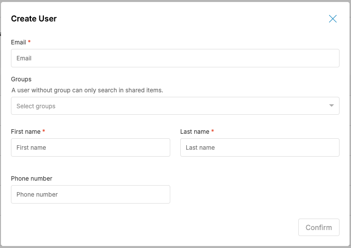

# Managing Users

Managing the repository of users is done through the administration interface in the **Users & Contacts** section.

  

## Creating a new user

Click the **New User** button and fill in the required fields:

* Email: The user's email is used as his unique identifier in Zeenea and also as his login
* Groups: A user can belong to one or several groups. Select groups to give extra permissions to the user. Note that there are two types of group licenses (Explorer and Data Steward) with different pricing). A user can also belong to no group. In this case, he has read access in the Explorer to the default catalog items and also to the shared items in the Federated Catalog
* First name/Lastname
* Phone number

  

:::note
Once the user is created, you can not modify his email address. If necessary, you delete and then recreate the user. 
:::

When you create a new user, a new contact is automatically created in the Zeenea repository.

## Defining the user password 

If you are using an identity federation for the connection with Zeenea: the password to use is therefore the one of the identity federation

If you are using a database specific to Zeenea for the connection, the user will receive 2 emails inviting him to validate his email address via a link and to change his password via a dedicated interface. The password must comply with a security level that is indicated to the user when it is set up.

## Editing a user

It is possible at any time to edit an existing user. Only two restrictions apply: 

* There must always be at least one user in the Super Admin group.
* Once the user is created, his email cannot be changed.

##  Deleting a user

You can delete a user directly from the list or the edition modal.

When deleting, three restrictions apply:

* You cannot delete your own user.
* You cannot delete the last Super Admin.
* You cannot delete a user assigned as a Curator of an item. Before deleting it, you must first delete the links.