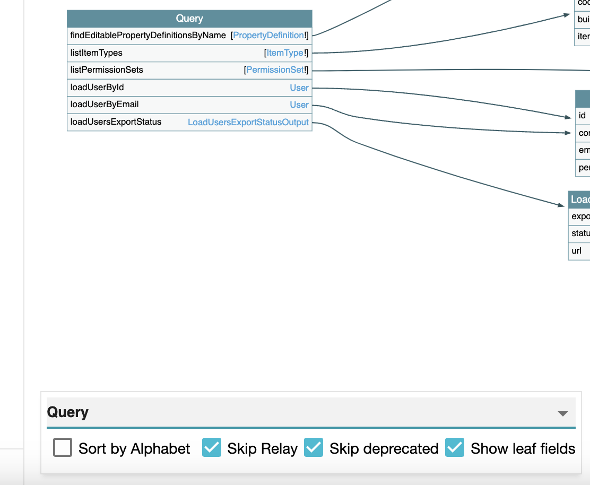

# Catalog Design API

The Catalog Design API allows you to retrieve and update details of your metamodel. You can also use this API to retrieve property id, which can in turn be used for other purposes. 
 
List of available operations:

* Retrieve information about a property by its name:
  * `findEditablePropertyDefinitionsByName`
* List all item types and their available links:
  * `listItemTypes`

## Permissions

The recommended permission scope for the Catalog Design API **Manage documentation** or **Read-only**.

## Using the API

The Catalog Design API uses the GraphQL language. GraphQL is an easy-to-implement language, that also allows you to specify, for each request, the information that you will get in return and that is relevant to your use case. 

More information on GraphQL can be found [here](https://graphql.org/).

Zeenea provides two tools for understanding and testing this GraphQL API: Voyager and Playground

### Voyager Documentation

You can access the full documentation for Zeenea GraphQL APIs by accessing [Voyager](https://github.com/APIs-guru/graphql-voyager), at the following URL: 

<pre>https://<font className="codeHighlight">[instance-name]</font>.zeenea.app/public-api/catalog/voyager</pre>

This tool allows you to access the entire documentation of the User Management API and in particular the available requests. 

Voyager also provides access to documentation for the User Management API, as well as for the Exploration and Mutation API v1 (deprecated).

Documentation in Voyager is split into two sections: 

* Query APIs, that will allow you to read Zeenea data
* Mutation APIs, that you can use to edit data

Navigate between both groups by using the selection menu in the bottom of the screen:



### Playground

If you wish to test your queries before running them, you can use the Playground tool, accessible here: 

<pre>
https://<font className="codeHighlight">[instance-name]</font>.zeenea.app/public-api/catalog/playground 
</pre>

:::note
To use the APIs with Playground, you will need a valid API Key in the "HTTP Headers" tab.
:::


## Use Case Examples

### Example 1: Retrieve a specific property's id and type
 
```
query FindPropertyByName($input: String!) {
   findEditablePropertyDefinitionsByName(input: {name: $input}) {
      id,
      name,
      type,
      valueFeedMode,
      options
    }
}
```

The above request will return the following:

```
{
  "data": {
    "findEditablePropertyDefinitionsByName": [
      {
        "id": "19cc5728-cb06-4b8e-8166-53310e1a6841",
        "name": "rich test",
        "type": "RICH_TEXT",
        "valueFeedMode": "USER",
        "options": []
      }
    ]
  }
}
``` 

### Example 2: List all possible values for a select-type property

```
query FindPropertyByName($input: String!) {
   findEditablePropertyDefinitionsByName(input: {name: $input}) {
      id,
      name,
      type,
      valueFeedMode,
      options
    }
}
```

The above request will return the following: 

```
{
  "data": {
    "findEditablePropertyDefinitionsByName": [
      {
        "id": "a1558053-f47e-4c03-8224-1bbf05b7a811",
        "name": "Select",
        "type": "SELECT",
        "valueFeedMode": "USER",
        "options": [
          "a",
          "b"
        ]
      }
    ]
  }
}
```