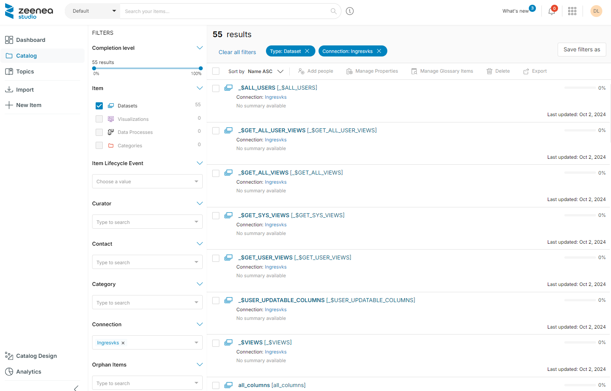
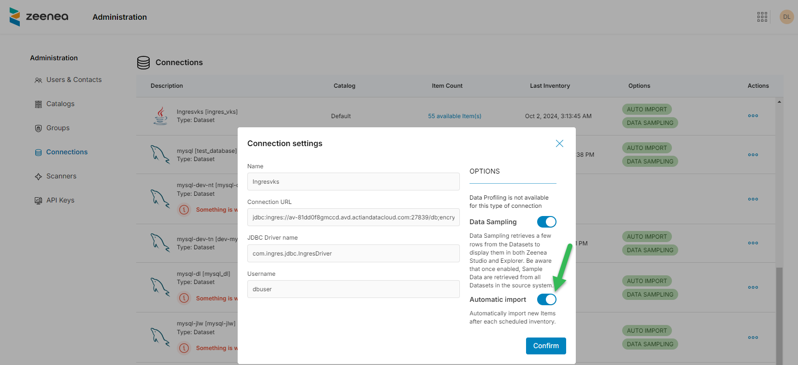

# Adding an Actian Ingres Connection

## Prerequisites

* The current Scanner version requires Java 11. Either OpenJDK or Oracle JDK can be installed.
* It is assumed that the Zeenea Scanner has been successfully downloaded and configured. See [Zeenea Scanner Setup](./zeenea-scanner-setup).

## Installing the Generic JDBC Connector Plugin

1. Download the Generic JDBC connector plugin from [Zeenea Connector Downloads](./zeenea-connectors-list), or download directly at https://plugins.zeenea.app/jdbc-connector-plugin/jdbc-connector-plugin-74.zip.
2. Move the zip file to the `[scanner_install_dir]/plugins` folder. **Do not unzip the archive**.

## Installing Ingres Drivers

1. Download the Actian Ingres driver zip file from [Actian ESD](https://esd.actian.com/). Select **Actian Ingres & Actian Vector Drivers** in the **PRODUCT** dropdown and select **JDBC** in the **RELEASE** dropdown.
2. Extract the Actian Ingres driver `iijdbc.jar` to the `[scanner_install_dir]/lib-ext` folder.

## Creating the Configuration File

1. In the `[scanner_install_dir]/connections` folder, create a new file named `ingres.conf`. (The file can be named as desired, but the file extension must be `.conf`.)
2. Copy and modify the content below based on your environment configuration, replacing `<HOST-NAME>`, `<USER>`, and `<PASSWORD>` with the appropriate values for your environment.

     ```
     # Customizable values for code and name
     code = "ingres-connector-code"
     name = "ingres-connector-name"

     # Connector ID (do not change)
     connector_id = "generic-jdbc"
     enabled = true

     connection {
        # JDBC URL to connect to the Ingres database
        url = "jdbc:ingres://<HOST-NAME>:27839/db;encryption=on;"
        jdbc_driver_name = "com.ingres.jdbc.IngresDriver"
        # Authentication details (modify as per environment)
        # Default password is an empty string
        username = "<USER>"
        password = "<PASSWORD>"
     }
     ```

## Verifying the Connection

1. Restart Zeenea Scanner.
2. In Zeenea Administration, click **Connections** and verify that the new connection is listed:

     
3. If you encounter any issues, review the scanner.log file located in the `[scanner_install_dir]/logs` folder for troubleshooting guidance. Also refer to [Troubleshooting for Scanners and Connections](./zeenea-troubleshooting).

## Viewing the Dataset
 
1. Switch to Zeenea Studio by clicking the apps icon in the upper right and selecting **Studio**:

     
2.  In Zeenea Studio, click **Catalog** to view the tables from your Actian Ingres schema:

     

## Configuring the Connection for Automatic Import

If desired, you can configure a connection to automatically import data as follows:

1. In Zeenea Administration, click **Connections**, then click the ellipsis button in the **Actions** column for your connection:

     
2. Toggle **Automatic import** on:

     
