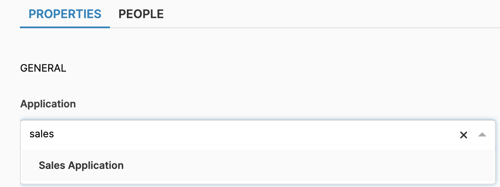
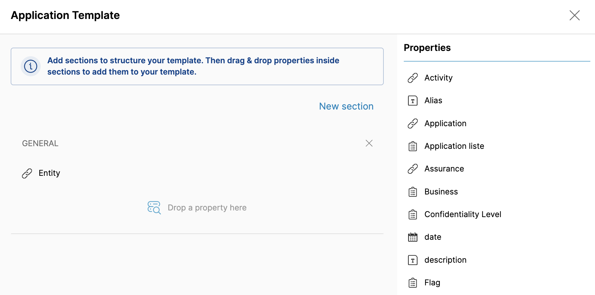
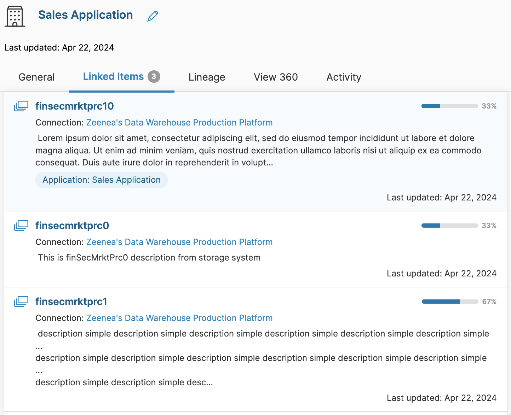
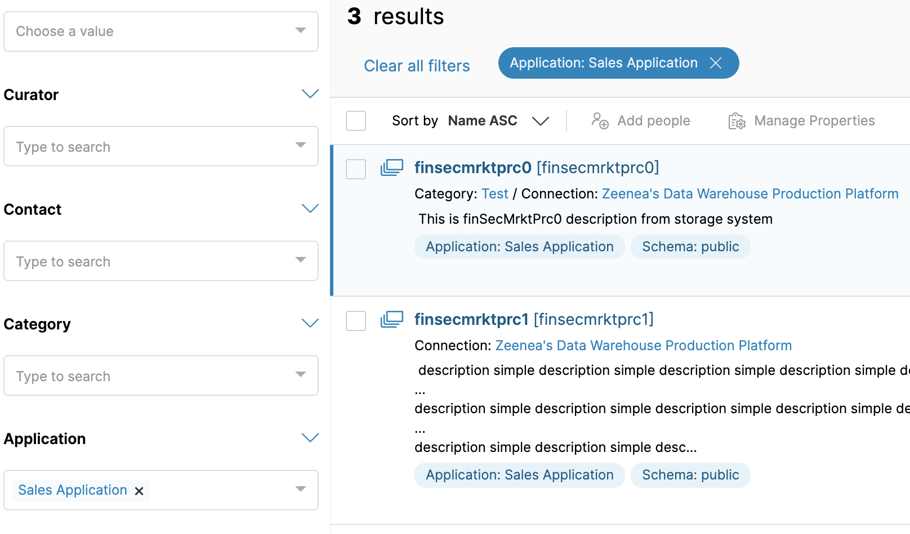

# How to Best Use Custom Items in your Catalog

Custom Items allow you to represent any concept that is specific to your needs. They also help you give more information about your assets, in a more detailed way than simple properties. 

Most common use cases for Custom Items are: 

* Categorizing your assets in a specific and adaptable way
* Building a business lineage for your assets

Each type of Custom Item has its own template in the Zeenea metamodel and its own set of attributes: description, contacts, etc… Custom Items can also be linked to other custom types (as well as native objects) in order to provide a richer context. 

Custom Items can be used to manage Business Concepts, otherwise not documented, directly in Zeenea, allowing you to better represent the way your data is organized.  These Business Concepts may be technical, protocols, governance, etc… 

This, in turn, allows you to onboard your users faster, by bringing them a much more relevant metamodel. 

Some examples of Custom Items are listed below: 

* Departments
* Applications
* Processes
* etc...

Custom Items allow the documentation of native technical objects to be completed by the addition of logical or organizational concepts and therefore complement the glossary which represents the semantic layer.

## Creating Links through Custom Items

Currently, Zeenea only supports hierarchical relationships (i.e., "Parent-Child"). 

Relationships are set up through specific properties and must be built starting at the "Child" level. 

This means that the Custom Item-specific attribute must be set on the Child metamodel. 

### Example 1: Creating an “Application” Custom Item

In order to link a dataset to an Application called "Sales Application", we’ll need to: 

* First, add the “Application” property on the Dataset template
* Fill out that property with the desired value "Customer360"

### Example 2: Creating a Hierarchy Between Two Custom Items

In order to create a link between a Custom Item Application and another Custom Item Entity, we’ll need to: 

* Create a new Custom Item type "Entity".
* Add the "Entity" property on the Application template.
* For each Application, select the entity to which it belongs.

## Reviewing All Linked Objects

By accessing the detailed page of a specific custom item (for example, an Application), you may review all objects that Application is linked to: 

Moreover, if a Custom Item-specific property has been tagged as “Use as filter”, then you may filter your catalog using an Application: 

If you’re using hierarchical links between Custom Items, you may also add use the Parent object as a filter (in our previous example, if you were to filter on the “Marketing” Entity, all objects linked to either the Entity itself or any Application whose parent is the “Marketing” entity). 

:::note[IMPORTANT]
Zeenea does not restrict link creation between Custom Items. It is the Data Steward(s) responsibility to ensure that each link created is relevant to the use case, and that the organization remains comprehensible. 

Customized objects allow the documentation of native technical objects to be completed by the addition of logical or organizational concepts and therefore complement the glossary which represents the semantic layer.
:::