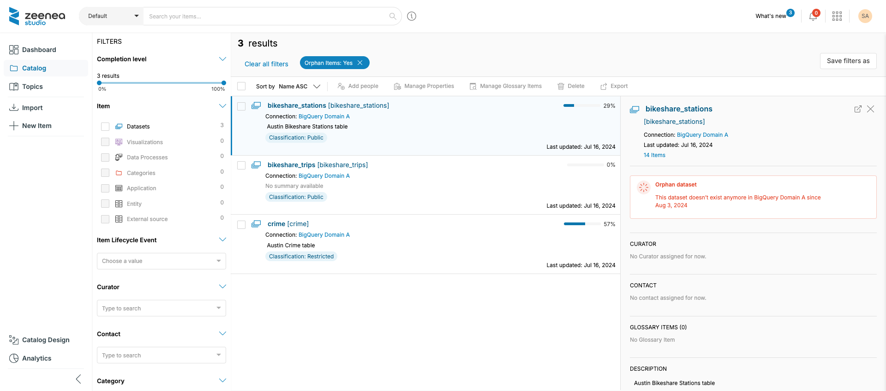
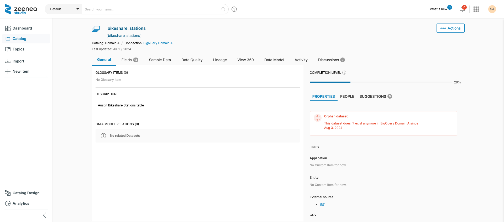

# Identifying Orphan Datasets

At each inventory of a connection, Zeenea checks the status of each dataset imported into the catalog. A dataset can then become an orphan.

Read more: [Orphan Dataset](./zeenea-definitions#orphan-dataset)
 
## Dataset Notifications

If a Dataset is no longer present in the inventory provided by the connection, an insert in red appears, indicating the date of the first inventory from which the Dataset was made an orphan. 

The latter is identified at different levels:

On the overview in the search:

  

On its detailed page:

  

## Deleting Orphan Datasets

The integration of its documentation will be removed from the catalog for all users.

* The **Yes** button on the red inserts allows you to delete the dataset and its fields directly from its overview.
* The trash can button at the top right of its detailed page also allows you to delete it.

## From the Search

You can also use the "Removed from connection" filter from the Catalog section of Zeenea Studio to quickly identify orphan datasets.
